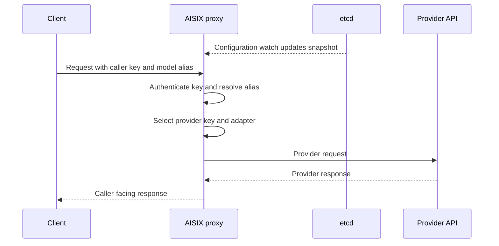

AISIX AI Gateway separates client traffic from configuration loading, usage
accounting, and provider translation.

Understanding these paths helps you plan production rollout behavior, size
rate limits across replicas, and choose provider adapters that preserve the
request details your applications need.

## Runtime Request Flow

AI requests are served from the configuration already loaded by each proxy. The
proxy does not call the Admin API for every request. It authenticates the caller
key, resolves the caller-facing model alias, selects the provider key, and then
sends the request through the matching provider adapter.

## Configuration Rollout

Configuration changes are written to etcd and watched by each proxy, but an
admin write can succeed before every proxy has applied the updated
configuration. Treat successful admin writes and proxy readiness as separate
states when you create resources and immediately send traffic.

For propagation checks and operational guidance, see
[Configuration Propagation](/ai-gateway/configuration/configuration-propagation).

## Rate Limit and Usage Accounting

Rate-limit accounting reserves request and concurrency capacity before
the provider request, then records provider-reported token usage after the
response.

When you run more than one proxy replica, choose a shared rate-limit backend
for quotas that must apply across replicas. See
[Rate Limits](/ai-gateway/configuration/rate-limits).

## Provider Translation

Protocol translation keeps the highest fidelity when the caller and upstream
use the same provider family. Anthropic Messages requests therefore keep more
native detail when routed to Anthropic upstreams than when translated to another
provider family.

Choose the adapter family that matches the upstream API format, then confirm
endpoint support before exposing the alias to callers. See
[Protocol Translation](protocol-translation.md) and
[Adapter Protocol Families](/ai-gateway/reference/adapters).

## Related Reading

For deeper architecture topics, see [Configuration Watch Architecture](snapshot-and-watch.md)
and [Two-Phase Rate Limit](two-phase-rate-limit.md).
