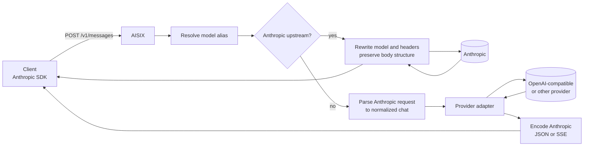

AISIX AI Gateway can route an Anthropic Messages request sent to
`POST /v1/messages` to different upstream provider families. The selected
upstream determines how much of the Anthropic request and response format can be
preserved.

When the upstream is Anthropic, AISIX rewrites the model and upstream headers,
then keeps the Anthropic request and response structure as close to the provider
format as possible. When the upstream is not Anthropic, AISIX translates the
request into the gateway chat format, sends it through the selected provider
adapter, and encodes the response back as Anthropic JSON or Anthropic SSE.

Both paths share API-key authentication, model resolution, logging,
metrics labels, health tracking, and rate-limit enforcement.

## Translation Behavior

Provider choice affects fidelity. Routing Anthropic Messages traffic to an
Anthropic upstream preserves Anthropic-specific fields better than
cross-provider translation can.

Cross-provider responses use the gateway model alias the caller sent, not the
upstream model ID. Streaming responses remain Anthropic-style: when a
non-Anthropic upstream streams provider-native chunks, AISIX emits Anthropic
SSE events such as `message_start`, `content_block_delta`, `message_delta`,
and `message_stop`.

Caller credentials are not forwarded upstream. AISIX injects the configured
provider key for the selected upstream and controls which response headers are
sent back to the client.

## Request Path

The branch happens after AISIX resolves the requested model alias. If the
resolved upstream provider is Anthropic, the request follows the
passthrough path. Otherwise, the request follows the translation path.

## Native Anthropic Path

When the upstream is Anthropic, AISIX keeps the request and response close to
the Anthropic provider format. This preserves fields that are hard to
round-trip through a generic chat representation, including `cache_control`
prompt-caching markers, `thinking` content blocks, Anthropic-native tool and
image content blocks, and request fields such as `metadata`, `top_k`, and
`stop_sequences`.

AISIX still performs gateway responsibilities before forwarding the
request. It resolves the caller-facing model alias to the upstream
Anthropic model, replaces the request `model` value with the upstream
model id, injects Anthropic headers such as `x-api-key`,
`anthropic-version`, `content-type`, and `x-aisix-request-id`, and
preserves the response structure for the caller.

For streaming responses, AISIX forwards the Anthropic event stream
without changing the event format. For non-streaming responses, AISIX can
inspect the response body for usage fields such as `usage.input_tokens` and
`usage.output_tokens`.

## Cross-Provider Translation

When an Anthropic Messages request targets a non-Anthropic upstream,
AISIX parses the request into a normalized chat representation,
sends it through the selected provider adapter, converts the
upstream response back to Anthropic JSON or Anthropic SSE, and preserves
the gateway model alias in the response.

The inbound parser handles the main structural differences between
Anthropic and OpenAI-compatible chat formats. `system` content is folded into a
system message where the target provider expects one. Tool definitions and
`tool_use` blocks are translated to the tool-call structure used by the target
adapter. `tool_choice` values are mapped to the closest supported
target-provider values.

For streaming responses, AISIX builds Anthropic SSE framing from the
upstream stream. A client using the Anthropic SDK still receives Anthropic
event types even when the upstream provider is not Anthropic.

## Translation Fidelity

Cross-provider translation is useful when applications need one
Anthropic-style client API while traffic is routed to different upstream
providers. It is not a promise that every Anthropic-only feature can be
represented by every upstream.

Prefer an Anthropic upstream when the application depends on
Anthropic-specific request or response fields. Use cross-provider
translation when the application depends on the broader message, tool,
and streaming format rather than provider-specific extensions.

## Related Reading

For caller-facing API behavior, see
[Anthropic Messages](/ai-gateway/integration/anthropic-messages),
[OpenAI-compatible API](/ai-gateway/integration/openai-compatible-api), and
[Adapter protocol families](/ai-gateway/reference/adapters).
