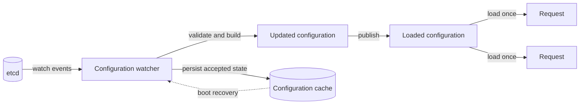
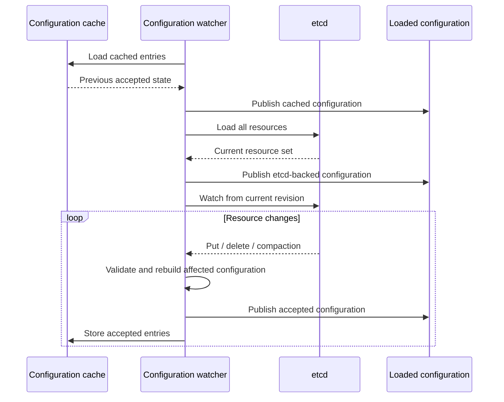

AISIX AI Gateway stores dynamic resources such as models, API keys,
provider keys, guardrails, cache policies, and rate-limit policies in
etcd. Proxy instances need those resources for every AI request, but
they do not call etcd on the request path.

Each proxy keeps a local view of the latest accepted configuration. A
configuration watch reads etcd, validates updates, and publishes a new
configuration view when resources change. A request loads the latest accepted
view once, then uses that same view for the lifetime of the request.

## Propagation Behavior

Configuration propagation is asynchronous. An admin write is accepted after the
control plane persists it, and each proxy applies the change after receiving
and validating the next watch event.

Requests do not wait on etcd. The request path reads from loaded
configuration, not from the backing configuration store. If a resource is
rejected, AISIX reports the rejection through heartbeat state while the proxy
keeps serving the last valid configuration.

In multi-replica deployments, each proxy watches independently, so different
proxy instances can briefly serve different accepted revisions.

## Propagation Flow

The propagation path has three parts. The configuration watch loads resources
from etcd, validates changes, and publishes accepted configuration. Loaded
configuration gives request handling and admin reads access to the accepted
view. The configuration cache stores accepted entries on disk so a managed data
plane can recover from a previous accepted state while reconnecting.

On each request, AISIX loads the current configuration, looks up the requested
model, follows references such as provider keys and policies, then forwards the
request using that one view. If newer configuration is published while the
request is in flight, that request keeps using the view it already loaded.

## Request Configuration Reads

The proxy loads configuration at the beginning of request handling. From that
point on, the request uses a single consistent view.

This matters for referenced resources. For example, a model can point to
a provider key, rate-limit policy, cache policy, and guardrail policy.
The request should not see the model from one revision and the provider
key from another revision. Holding one configuration view for the full request
keeps those lookups consistent.

Publishing a new configuration view lets request reads continue while newer
configuration is being prepared. The trade-off is that an old view can stay in
memory until the last request using it finishes.

## Configuration Updates

The configuration watch applies resource updates. On startup, it can replay the
configuration cache, then connect to etcd, load the full resource set, and
start watching for updates.

For a resource update, the configuration watch validates the new entry before
it can enter the loaded configuration. For a delete, it removes the entry from
the next published configuration view. If the etcd watch is compacted, AISIX
performs a full resync.

## Request Consistency

AISIX publishes new configuration views instead of mutating live configuration
in place. This keeps request reads consistent while configuration changes are
applied. Request reads do not block while configuration is published, a request
cannot observe half-applied configuration, and a failed validation cannot
partially modify live state. The old configuration view remains available to
requests that already loaded it.

Most resource entries are shared by reference between old and new
configuration views. Publishing a new view therefore does not duplicate every
model, key, or policy payload on every update.

## Failure and Recovery Behavior

If etcd is temporarily unavailable, an already-running proxy continues
serving from its latest accepted configuration. On restart, a proxy can replay
the configuration cache before the etcd connection is fully restored.

Treat the cache as a resilience mechanism, not as a replacement for etcd. New
configuration changes, deletes, validation state, and fleet-wide convergence
still depend on restoring the watch connection.

## Troubleshooting Checks

When configuration does not appear to take effect, confirm that the admin
write succeeded, check proxy health and heartbeat state for rejected
resources, and verify that the target proxy instance has reconnected to
the configuration source. In multi-replica deployments, test more than
one instance or wait for the fleet to converge.

## Related Reading

For operational guidance, see
[Configuration propagation](/ai-gateway/configuration/configuration-propagation),
[Health checks](/ai-gateway/operations/health-checks), and
[Offline resilience](/ai-gateway/cloud/offline-resilience).
