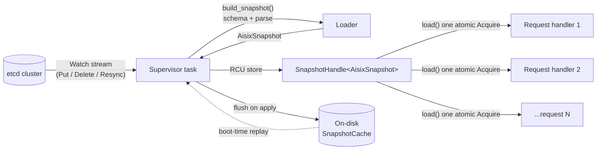
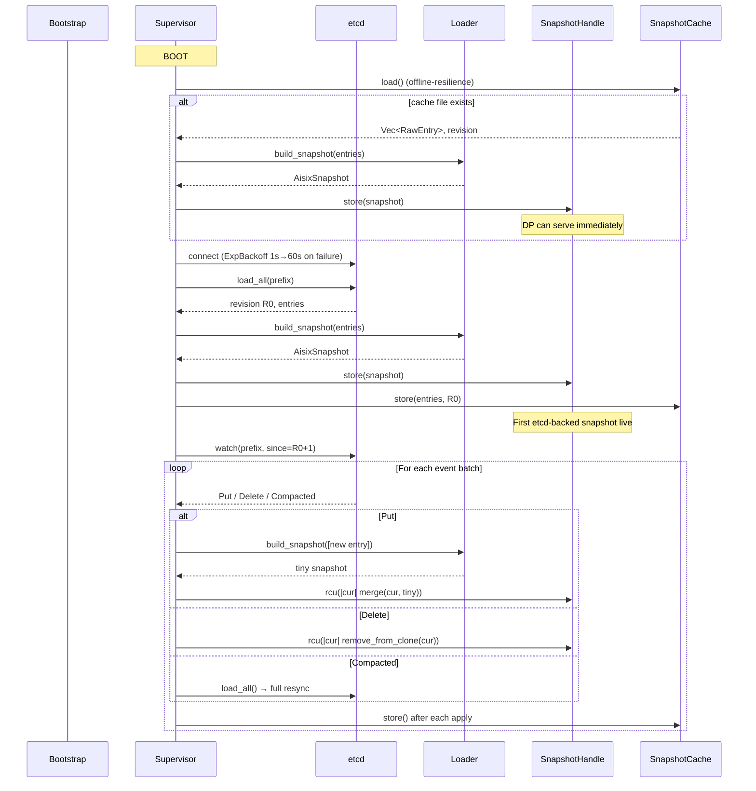

# Snapshot and Watch

The data plane (DP) serves `/v1/chat/completions` and its cousins
hundreds to thousands of requests per second. Every request needs to
look up a `Model`, an `ApiKey`, a `ProviderKey`, sometimes a
`Guardrail` and a `CachePolicy`. The configuration backing these
resources lives in etcd, which the control plane writes to. The DP
cannot pay etcd's per-request round-trip on the hot path, and it
cannot take a mutex on its in-memory copy either — a single
contended `Mutex` across the request handler is a hard ceiling on
throughput long before the upstream LLM is.

This page walks through the design that resolves these two
constraints: a lock-free in-memory snapshot atomically replaced by a
background watch supervisor.

## Component overview



Three components, in order of who owns the data:

- **[`aisix_etcd::Supervisor`](https://github.com/api7/ai-gateway/blob/main/crates/aisix-etcd/src/supervisor.rs)**
  — the single long-running tokio task that owns the etcd watch
  stream. Drains events, builds new snapshots, and atomically
  publishes them.
- **[`aisix_core::SnapshotHandle<S>`](https://github.com/api7/ai-gateway/blob/main/crates/aisix-core/src/snapshot.rs)**
  — the lock-free handle every consumer reads from. Cheap to clone
  (just clones an `Arc`), atomic to load.
- **[`aisix_core::ResourceTable<T>`](https://github.com/api7/ai-gateway/blob/main/crates/aisix-core/src/snapshot.rs)**
  — per-kind table inside `AisixSnapshot`. Two `DashMap` indices
  (id and name) sharing one `Arc<ResourceEntry<T>>`.

The hot path is the rightmost arrows: an HTTP handler calls
`state.snapshot.load()` and gets back an `Arc<AisixSnapshot>` valid
for the duration of the request. Nothing else on the request path
talks to etcd; nothing else takes a lock.

## Read path: one atomic Acquire load

The hot path is the chat-completions handler. The model lookup at
the top of the request is the canonical shape every other
snapshot-using handler follows
([`crates/aisix-proxy/src/chat.rs:387`](https://github.com/api7/ai-gateway/blob/main/crates/aisix-proxy/src/chat.rs#L387)):

```rust
let snapshot = state.snapshot.load();
let virtual_entry = snapshot
    .models
    .get_by_name(&req.model)
    .ok_or_else(|| (None, None, ProxyError::ModelNotFound(req.model.clone())))?;
// `snapshot` stays live for the rest of the request, even if a
// concurrent supervisor apply has already replaced the handle's
// pointer with a new snapshot — Arc keeps the old one alive
// until this handler drops it.
```

`load()` returns a fresh `Arc<S>` without taking any lock
([`snapshot.rs:145`](https://github.com/api7/ai-gateway/blob/main/crates/aisix-core/src/snapshot.rs#L145)
delegates to [`ArcSwap::load_full`](https://docs.rs/arc-swap/latest/arc_swap/struct.ArcSwapAny.html#method.load_full),
which uses a hybrid hazard-pointer scheme to publish the read
without blocking writers or other readers).

The `Arc<AisixSnapshot>` the handler holds is *immutable* for its
lifetime. The supervisor cannot mutate a snapshot a handler is
reading; it can only publish a new snapshot. The handler's view
stays self-consistent — looking up a model and then looking up its
referenced provider_key on the *same* snapshot guarantees both
exist or both don't, never half-and-half.

### Why ArcSwap, not RwLock

`Arc<RwLock<AisixSnapshot>>` would satisfy correctness but cost
everything ArcSwap was chosen to avoid:

| Property | `Arc<RwLock<S>>` | `ArcSwap<S>` |
|---|---|---|
| Read cost | uncontended: atomic CAS pair; contended: blocks on writer (and kernel-wait under contention) | atomic load, no blocking |
| Writer starvation | possible (constant readers) | impossible (writer publishes asynchronously) |
| Holding a read past an `await` | requires `RwLockReadGuard` to be `Send` and not crossing yields | trivial: `Arc<S>` is `Send + Sync` |
| Memory while writers active | one copy | two copies briefly (old reader-held + new published) |

The Arc refcount bump on every read is the cost paid for the
write-side wins. It is dominated by the request body parse and
upstream TLS handshake on any realistic workload.

ArcSwap also makes the writer side simpler: the supervisor doesn't
need to coordinate with readers, doesn't wait for any reader to
finish, and doesn't introduce a writer-priority dance. It just
swaps the pointer and lets the runtime's reference counter clean
up the old snapshot whenever the last reader finishes with it.

## Write path: etcd watch → loader → RCU swap

The supervisor is the only writer
([`crates/aisix-etcd/src/supervisor.rs:548`](https://github.com/api7/ai-gateway/blob/main/crates/aisix-etcd/src/supervisor.rs#L548)).
Its lifecycle:



Three apply paths, all going through the same `SnapshotHandle`:

- **`apply_put`** ([`supervisor.rs:322`](https://github.com/api7/ai-gateway/blob/main/crates/aisix-etcd/src/supervisor.rs#L322))
  — builds a tiny one-entry snapshot via the loader (which runs the
  same schema + parse the bootstrap path uses), then merges into a
  fresh clone of the current snapshot. Schema-rejected entries
  never reach the live snapshot; they surface as
  [`rejected_resources`](https://github.com/api7/ai-gateway/blob/main/crates/aisix-server/src/heartbeat.rs#L181)
  on the next heartbeat so cp-api can show them in the dashboard.
- **`apply_delete`** ([`supervisor.rs:399`](https://github.com/api7/ai-gateway/blob/main/crates/aisix-etcd/src/supervisor.rs#L399))
  — clones the current snapshot, removes the entry from the right
  `ResourceTable`, publishes.
- **`apply_resync`** ([`supervisor.rs:485`](https://github.com/api7/ai-gateway/blob/main/crates/aisix-etcd/src/supervisor.rs#L485))
  — wholesale replacement. Triggered on initial load and on etcd
  compaction (when the watch revision is older than etcd's
  minimum). Uses `store()` (full replace) rather than `rcu()`.

### Why copy-on-write per apply

Both `apply_put` and `apply_delete` *clone* the entire snapshot
before mutating. This is deliberate — it's the only way to keep
the read path lock-free.

The alternative (mutate-in-place under a `Mutex`) would force
every reader to either:

1. Take the same lock (kills the lock-free promise), or
2. Read a torn snapshot mid-write (correctness disaster).

The clone is not as expensive as it sounds. `ResourceTable<T>`
holds `Arc<ResourceEntry<T>>` — the per-entry `Arc` count gets
bumped, but the entry payload (Model, ApiKey, etc.) is never
duplicated. For a typical org with 50 models, 200 api_keys, 10
provider_keys, the per-apply allocation is dominated by the two
`DashMap` shards' worth of pointer-bumps. At typical configuration
sizes the clone completes well under the latency floor of any LLM
upstream call; the supervisor task is never on the hot path.

### Why RCU, not load-mutate-store

The first version of `apply_put` did the obvious thing:

```rust
let cur = handle.load();          // bug: snapshot of state at T0
let mut new = clone(cur);
new.insert(entry);                // mutation based on T0
handle.store(new);                // publishes at T1 — but what if a
                                  // concurrent apply_put landed at T0.5?
```

Two `apply_put`s racing this way silently drop one of the events —
both load the same `cur`, both publish their respective `new`, and
only the last `store()` wins (see [issue #112](https://github.com/api7/ai-gateway/issues/112)).
The current code uses ArcSwap's `rcu()`
([`snapshot.rs:176`](https://github.com/api7/ai-gateway/blob/main/crates/aisix-core/src/snapshot.rs#L176)):

```rust
self.handle.rcu(|current| {
    let new = clone_snapshot(current);
    for e in tiny.models.entries()       { new.models.insert(clone_entry(&e)); }
    for e in tiny.apikeys.entries()      { new.apikeys.insert(clone_entry(&e)); }
    // ... every kind …
    new
});
```

`rcu` does a CAS-on-publish; if a concurrent writer beat us, the
closure runs again against the new current. The closure body must
therefore be **idempotent w.r.t. its input** — clone the input,
apply the same delta, return. We carefully use `tiny` (the parsed
event payload, captured by reference) as the only outside source,
and `clone_snapshot(current)` as the base — no side data, no
single-observation pulls.

The closure can run more than once under contention. In practice
the apply rate is ~one event per millisecond at peak; retry
amplification is invisible.

### One subtle correctness invariant

The "merge tiny into new" loop ([`supervisor.rs:352-372`](https://github.com/api7/ai-gateway/blob/main/crates/aisix-etcd/src/supervisor.rs#L352))
must cover **every** `ResourceTable` on `AisixSnapshot`. A missing
kind here means the watch path silently drops events of that kind
even though the loader and the proxy both know about them. The
test `all_three_tables_are_independent`
([`models/snapshot.rs:88`](https://github.com/api7/ai-gateway/blob/main/crates/aisix-core/src/models/snapshot.rs#L88))
gives a sanity check that the three foundational tables (models,
api_keys, provider_keys) stay shard-independent; it does **not**
cover the newer tables (guardrails, cache_policies,
observability_exporters, rate_limit_policies). Adding a new
resource kind is still a three-place change (model struct,
snapshot field, merge loop) — reviewers should treat the merge-loop
hop as the easy-to-miss step and verify by hand. A 7-table
invariant test that catches a missing merge entry is filed as a
follow-up.

## Per-kind `ResourceTable` and the dual index

Every resource lookup is by either id (canonical) or name (the
human-friendly label):

- `Model.display_name` — the value clients send in
  `{"model": "..."}` on the request body
- `ApiKey.key_hash` — the SHA-256 of the bearer the proxy hashed
  before lookup
- `ProviderKey.display_name` — admin / dashboard surface

`ResourceTable<T>` keeps two `DashMap` indices
([`snapshot.rs:29`](https://github.com/api7/ai-gateway/blob/main/crates/aisix-core/src/snapshot.rs#L29)):

```rust
pub struct ResourceTable<T: Resource> {
    by_id:   DashMap<String, Arc<ResourceEntry<T>>>,  // primary
    by_name: DashMap<String, String>,                 // secondary → id
}
```

The secondary index stores ids, not entries. Insert / remove /
rename keep both indices coherent
([`snapshot.rs:60`](https://github.com/api7/ai-gateway/blob/main/crates/aisix-core/src/snapshot.rs#L60)).
A rename (`insert` with same id, different name) walks both maps:
remove the old name → id, insert new name → id, replace the entry
under id.

`DashMap` is sharded — the per-shard `RwLock` is contended only on
hash collisions, which at this scale are statistical noise.
Crucially, `DashMap` reads do not take a global lock; the shard
lock is per-key. Reading entry A and entry B uses two independent
shards.

`name_conflicts()` ([`snapshot.rs:96`](https://github.com/api7/ai-gateway/blob/main/crates/aisix-core/src/snapshot.rs#L96))
exposes duplicate-name detection to the admin API so a `POST
/admin/v1/models` returns `409 DUPLICATE_NAME` instead of silently
overwriting.

## Failure modes and recovery

### etcd partition

The supervisor's watch stream stays open; events stop arriving.
The DP keeps serving from the last published snapshot. `WatchStatus`
([`supervisor.rs:46`](https://github.com/api7/ai-gateway/blob/main/crates/aisix-etcd/src/supervisor.rs#L46))
exposes the apply age (serialised as `snapshot_age_seconds` on the
wire — see
[`health_handler.rs:63`](https://github.com/api7/ai-gateway/blob/main/crates/aisix-admin/src/health_handler.rs#L63))
to `/admin/v1/health`, so operators see the freshness gap. The
cache file on disk is the same data the in-memory snapshot
reflects, so even a DP restart during partition boots into the
cached state and keeps serving.

### etcd compaction

If the supervisor reconnects after being away long enough for etcd
to compact the watch revision, the watch returns a `Compacted`
event. The supervisor responds by restarting its cycle — calling
`load_all` ([`supervisor.rs:593`](https://github.com/api7/ai-gateway/blob/main/crates/aisix-etcd/src/supervisor.rs#L593))
and then `apply_resync` ([`supervisor.rs:485`](https://github.com/api7/ai-gateway/blob/main/crates/aisix-etcd/src/supervisor.rs#L485))
to wholesale-replace the snapshot via `store()`. The revision
counter resets to the new etcd revision.

### Transport failure / reconnect

Watch stream errors trigger exponential backoff
([`crates/aisix-etcd/src/backoff.rs`](https://github.com/api7/ai-gateway/blob/main/crates/aisix-etcd/src/backoff.rs))
— 1s, 2s, 4s, … up to a 60s ceiling. Each retry is a fresh
`load_all` + `watch` pair. The DP keeps the previous snapshot live
during the backoff window.

### Cache corruption

The snapshot cache file uses an atomic rename strategy
([`crates/aisix-etcd/src/snapshot_cache.rs`](https://github.com/api7/ai-gateway/blob/main/crates/aisix-etcd/src/snapshot_cache.rs)):
write to `<path>.tmp`, fsync, rename over `<path>`. A torn write
never corrupts the committed file. On boot, a malformed cache
parses to `None` and the supervisor proceeds without an offline
fallback — the DP refuses to serve until the first etcd `load_all`
succeeds.

## Memory bounds under churn

ArcSwap keeps the *current* snapshot pinned plus one or more
*previous* snapshots held by in-flight readers. Worst case at peak
load is roughly:

```
mem ≈ size_of(snapshot) × (1 + ⌈in-flight requests / new-snapshot interval⌉)
```

Pinned snapshots get reclaimed as in-flight requests finish. In
the steady state the holdover is bounded by how many publishes
happen during the lifetime of an outstanding request — etcd writes
are operator-driven, not request-driven, so real-world write rates
are sub-Hz and the holdover collapses to one or two snapshots.

In a runaway scenario (publishes faster than request duration),
the holdover could grow until the slowest in-flight reader
returns. We have not observed this in practice; if it ever
materialises, the supervisor's apply rate is the operator-visible
lever to throttle.

## Operational observability

Three things to look at when the DP seems stale:

1. **`/admin/v1/health`** surfaces `snapshot_age_seconds` derived
   from `WatchStatus::snapshot()`
   ([`supervisor.rs:93`](https://github.com/api7/ai-gateway/blob/main/crates/aisix-etcd/src/supervisor.rs#L93)).
   A non-trivial age (minutes) means the supervisor isn't getting
   events.
2. **`/admin/openapi.json`** does *not* include this; it's a
   supervisor / control-plane signal, not a data-plane contract.
3. **`SnapshotCache` on disk** — its `revision` field is the
   highest etcd revision the DP knows about. If you stop the
   process and inspect the file, you can see exactly which etcd
   state it would resume from.

For an automated alert, scrape `snapshot_age_seconds` from
`/admin/v1/health` and alert when it exceeds the expected
control-plane write quiet period. The supervisor also logs every
event apply at info level when `access_log` is enabled.

## What this design does not do

- **Per-key reads are not real-time.** A `POST /api/models` to
  cp-api returns OK only after kine accepts the write; the DP
  observes it on the next watch event (typically <100ms, but not
  guaranteed instant). Code that requires "this model is
  immediately routable after create" must poll the DP's
  `/admin/v1/models` instead of relying on the cp-api response.
- **No multi-DP coordination.** Each DP instance runs its own
  supervisor against the same etcd; they pick up events
  independently — eventual consistency only. Each DP does report
  the highest revision it has applied as the `applied_revision`
  field of its heartbeat payload, so cp-api can compare it against
  the revision returned by its own kine write and surface per-DP
  propagation state, but the DPs never coordinate among themselves.
- **No partial loads.** The loader is all-or-nothing per entry —
  schema fails ⇒ entry rejected ⇒ never enters the snapshot. The
  proxy never sees a half-valid Model with a missing field. The
  rejected entry surfaces through the
  [`rejected_resources`](https://github.com/api7/ai-gateway/blob/main/crates/aisix-server/src/heartbeat.rs#L181)
  field of the heartbeat payload to cp-api.

## Further reading

- **[Two-Phase Rate Limit](two-phase-rate-limit.md)** — how the proxy
  uses the snapshot's `RateLimit` config without a hot-path lock.
- **[Protocol Translation](protocol-translation.md)** — how
  `/v1/messages` synthesizes Anthropic SSE from non-Anthropic
  upstreams using snapshot-resolved `Model` + `ProviderKey`.
- The
  [`arc_swap::ArcSwap` rustdoc](https://docs.rs/arc-swap/latest/arc_swap/struct.ArcSwap.html#method.rcu)
  walks through why a load-mutate-store sequence is unsound and how
  `rcu` corrects it.
- [DashMap design notes](https://docs.rs/dashmap/latest/dashmap/) —
  the shard layout backing both indices.
