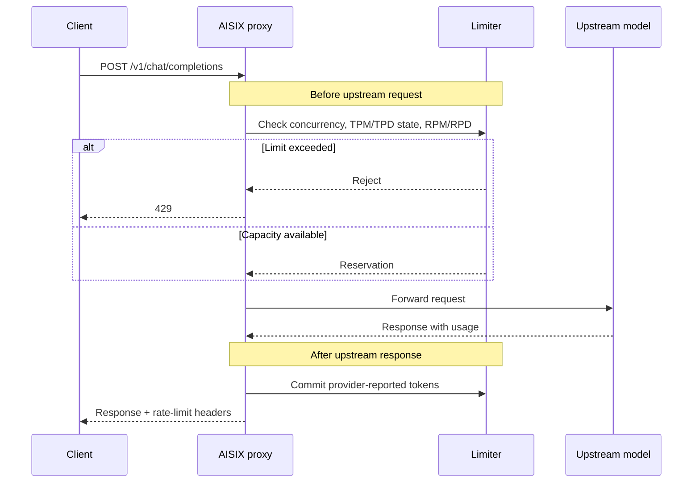

LLM rate limiting differs from most REST API rate limiting because request,
token, and concurrency costs become known at different times.

Request limits, such as requests per minute and requests per day (RPM / RPD),
are known before the upstream request. Every accepted request consumes one
request slot. Token limits, such as tokens per minute and tokens per day
(TPM / TPD), are known after the upstream response, when the provider returns
usage data. Concurrency is known during the upstream request and controls how
many requests can be in flight at the same time.

AISIX AI Gateway uses a two-phase reservation pattern. Before the upstream
call, the gateway reserves request and concurrency capacity. After the upstream
returns, the gateway records token usage from the provider response.

## How Limits Are Charged

Request limits are charged before the upstream request. A request that reaches
the upstream consumes an RPM or RPD slot even if the upstream later fails.

Token limits use provider-reported usage. AISIX does not estimate prompt or
completion tokens before the upstream request. Because the token count arrives
after the response, a large response can push a token bucket over the cap and
cause the next request to be rejected.

Counters are per proxy instance. In multi-replica deployments, each proxy
tracks its own in-process counters unless an external traffic strategy accounts
for the replica count.

## Request Lifecycle

The first check creates a reservation. The reservation holds the concurrency
slot and records which request counters have already been charged. When the
response completes, AISIX records token usage and releases the concurrency
slot. If the request ends before token usage is recorded, AISIX still releases
the concurrency slot.

## Enforcement Details

Concurrency is checked and reserved before the upstream request. AISIX
rejects the request when the in-flight count is already at the cap. The
reservation releases the concurrency slot after the response completes or
when the reservation is dropped.

RPM is checked and updated before the upstream request. Every accepted
request consumes one RPM slot.

RPD is also checked and updated before the upstream request. If RPD fails
after RPM was incremented, AISIX removes the RPM charge for that rejected
request.

TPM is checked before the upstream request only to determine whether the
current token window is already over the cap. AISIX adds token usage
after the upstream response returns provider-reported usage.

TPD follows the same two-phase token pattern. AISIX checks the current
daily token window before the upstream request and adds provider-reported token
usage after the upstream response.

This design avoids local token estimation. Provider tokenizers differ,
reasoning models can add hidden reasoning tokens, and tool outputs can change
completion size. AISIX records token counts from the provider usage block.

## Fixed-Window Counters

AISIX uses fixed windows for RPM, RPD, TPM, and TPD:

RPM and TPM use a 60-second window. RPD and TPD use a 24-hour window.
A window rolls when the current time moves into the next bucket.

Fixed windows can allow a burst near a boundary. For example, traffic can
arrive at the end of one minute and again at the start of the next. AISIX
accepts that behavior in exchange for simple, predictable counter behavior.

When a request-limit bucket is full, AISIX returns `429` with a
`Retry-After` value based on the end of the current window. Concurrency
rejections do not have a predictable window boundary, so they do not use
the same retry hint.

## Multi-Replica Behavior

Rate-limit counters are stored in process memory. If you run three proxy
instances with an RPM cap of `60`, each instance can accept up to `60`
requests per minute for the same key. A load balancer that spreads
traffic evenly can therefore allow up to roughly `180` requests per
minute across the fleet.

When you need tighter fleet-wide limits, size the configured limits for
the number of proxy replicas, route a given tenant, API key, or model
consistently to the same proxy group, or enforce an additional external
quota layer before traffic reaches AISIX.

## Headers and Errors

Successful responses include rate-limit headers that describe the
relevant remaining capacity. Rejections use `429` and the gateway error
envelope described in [Headers and error codes](/ai-gateway/reference/headers-and-error-codes).

Token-limit rejections can occur before the upstream request if a previous
response already pushed the token window over the cap. In that state, the
gateway prevents the next request from increasing an already-exceeded token
bucket.

## Related Reading

For configuration and operational details, see
[Rate limits](/ai-gateway/configuration/rate-limits),
[Headers and error codes](/ai-gateway/reference/headers-and-error-codes), and
[Production deployment](/ai-gateway/operations/production-deployment).
