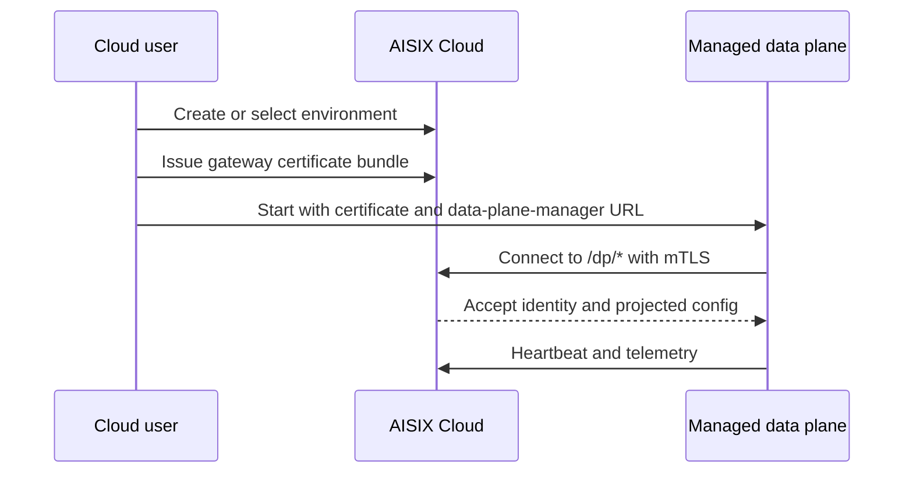

AISIX Cloud uses certificate-based bootstrap for managed data planes. The
data plane receives a certificate bundle, then authenticates to the
Cloud data-plane-manager endpoints with mTLS.

When managed bootstrap fails, check certificate bundle, trust root,
runtime state, and `/dp/*` connectivity before looking at higher-level
routing or projection behavior.

## Managed Bootstrap Flow

The managed flow starts with an environment and gateway certificate bundle,
then starts the data plane with the bundle and data-plane-manager URL. The data
plane authenticates to `/dp/*` routes with mTLS and then reports heartbeat,
telemetry, and configuration projection state.

The certificate bundle flow is the managed bootstrap path. Use the issued
certificate, key, and CA bundle rather than bearer-token registration for
managed data planes.

## Bootstrap Requirements

Before starting the managed data plane, confirm the environment is the one you
expect to serve and the certificate, key, and CA come from the issued gateway
bundle. Projection is environment-scoped, and `/dp/*` authentication uses this
mTLS identity.

The data plane also needs a readable certificate bundle, a writable runtime
state directory, and outbound network access to the data-plane-manager
endpoint. Bootstrap can succeed only if the data plane can reach `/dp/*`.

The managed data-plane connection uses the data-plane-manager API for
heartbeat, telemetry, certificate rotation, and budget checks. These routes
include `POST /dp/heartbeat`, `POST /dp/telemetry`, `POST /dp/rotate-cert`,
and `GET /dp/budget_check`. They belong to the data-plane-manager origin, not
the AISIX Cloud web console origin.

`AISIX_MANAGED__CP_BASE_URL` must point to the data-plane-manager origin
that serves `/dp/heartbeat`, `/dp/telemetry`, `/dp/rotate-cert`, and
`/dp/budget_check`.

For an externally reachable data-plane-manager endpoint, the value may look
like `https://dpm.example.com:7944`. For a data plane joined to the AISIX Cloud
Compose network, it may look like `https://dpm:7944`.

Do not use the AISIX Cloud web console or control-plane API origin, such as
`http://api:8080`, for this value.

The data plane accepts either inline PEM values
(`AISIX_MANAGED__CP_CERT_PEM`, `AISIX_MANAGED__CP_KEY_PEM`, and
`AISIX_MANAGED__CP_CA_PEM`) or file paths
(`AISIX_MANAGED__CP_CERT_FILE`, `AISIX_MANAGED__CP_KEY_FILE`, and
`AISIX_MANAGED__CP_CA_FILE`).

If you use file paths from a container, make sure the process user can
read the files and write the runtime state directory, typically
`/var/lib/aisix`. The state directory stores the persisted mTLS bundle
and data-plane identity used on restart.

## Verify Managed Connectivity

After the data plane starts, verify the managed path in order. The process
should start without certificate or trust-chain errors, Cloud should show the
data-plane heartbeat for the expected environment, projected resources should
reach the data plane, a live request through the managed data-plane endpoint
should succeed, and usage events or telemetry should appear in Cloud for that
request.

If heartbeat fails, continue certificate, base URL, and network
troubleshooting. If heartbeat is healthy but projection or live requests fail,
move to [Resource projection](/ai-gateway/cloud/resource-projection).

## Troubleshooting

### The Data Plane Never Appears Healthy in Cloud

Check `AISIX_MANAGED__CP_BASE_URL`, the certificate bundle, file readability,
runtime-state write access, and network policy. The base URL must point to the
data-plane-manager origin, the certificate, key, and CA must match the issued
bundle, and the data plane must be able to reach the `/dp/*` endpoints.

### Data-Plane Calls Fail After Initial Success

Inspect certificate rotation, trust-chain changes, and runtime state
first. If identity is healthy but resources still do not apply, move to
projection troubleshooting.

## Related Reading

For how Cloud resources reach the data plane, see
[Resource projection](/ai-gateway/cloud/resource-projection). For temporary
Cloud connectivity loss and transport security, see
[Offline resilience](/ai-gateway/cloud/offline-resilience) and
[TLS and mTLS](/ai-gateway/operations/tls-and-mtls).
