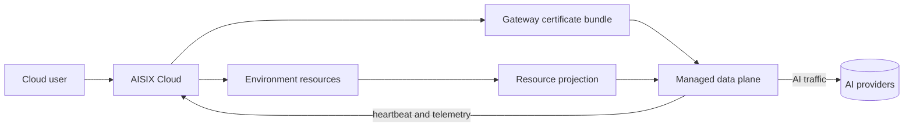

AISIX Cloud adds a managed control plane for AISIX AI Gateway. Instead
of managing every gateway resource through a local admin API, you manage
organization and environment resources in Cloud and let the managed data
plane receive projected configuration.

Use AISIX Cloud when you want AISIX gateway behavior with managed
environment scope, certificate-based data-plane bootstrap, telemetry,
budget workflows, and Cloud-side operational visibility.

## Cloud Operating Model

AISIX Cloud adds organization and environment scope, gateway certificate
issuance, resource projection, usage and budget workflows, and offline
resilience on top of the gateway runtime. The gateway still serves live AI
traffic in the data plane, but Cloud changes how resources are scoped,
delivered, observed, and managed.

The data plane authenticates to managed `/dp/*` routes with mTLS, receives
environment-scoped configuration, emits telemetry, and applies returned budget
decisions. During temporary control-plane connectivity loss, it can continue
serving from the latest accepted configuration.

## Managed Path

At a high level, users create or select an organization and environment, define
environment-scoped gateway resources, issue a gateway certificate bundle, and
start the managed data plane with the Cloud bootstrap inputs. The data plane is
ready for traffic after projection and heartbeat are healthy.

## When AISIX Cloud Fits

AISIX Cloud fits teams that want environment-scoped gateway management,
managed certificate issuance, mTLS data-plane workflows, and Cloud-side
usage, billing, and budget features. It also avoids making the standalone
admin API the primary management API.

Choose self-hosted AISIX when you want direct local ownership of the
gateway process, etcd, bootstrap config, and admin API.

## Managed Operation Differences

Cloud and self-hosted deployments share the gateway runtime, but they do
not have the same operational model. In Cloud mode, the control plane
projects resources into the data plane asynchronously. A saved resource
in Cloud is not the same event as that resource being active on a
specific data-plane instance.

The Cloud playground is a separate path: it is useful for Cloud UI
checks, but it does not exercise every live data-plane feature such as
routing, cache, guardrails, and rate limits.

When debugging Cloud-managed behavior, confirm the resource belongs to the
environment served by the data plane, the managed data plane is healthy and
connected, and the request uses the managed data-plane endpoint. Cloud UI
checks are useful, but they do not exercise every live data-plane feature.

## Related Reading

For Cloud resource scope, see
[Organizations and environments](/ai-gateway/cloud/organizations-and-environments).
For managed bootstrap, see
[Gateway certificates and managed data plane](/ai-gateway/cloud/gateway-certificates-and-managed-dp).
For a mode comparison, see
[Cloud vs. self-hosted](/ai-gateway/cloud/cloud-vs-self-hosted).
