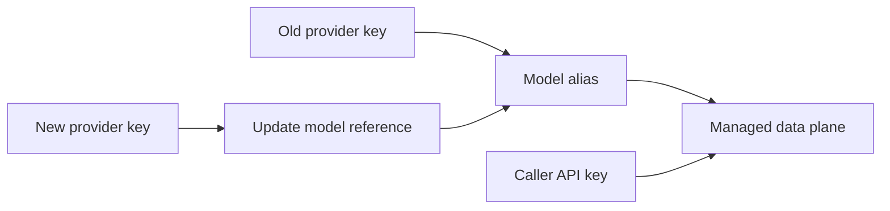

Provider key rotation changes the upstream credential behind a model
without changing the caller-facing API key or model alias.

This separation is one of the main reasons to put AISIX between
applications and AI providers. Callers keep using the same AISIX API key
and model name while the provider credential is rotated behind the
gateway.

## Rotate a Provider Key

To rotate an upstream credential, create a replacement provider key, update
the model to reference it, and wait for projection to reach the managed data
plane. Send a live request through the managed endpoint before removing or
disabling the old provider key.

The caller does not need a new AISIX API key. The application also does
not need to change the model alias if the model resource keeps the same
name.

What changes is the provider key reference AISIX uses when it sends
the request upstream.

## Verify Rotation

After rotation, confirm the model references the replacement provider key, the
update reached the managed data plane, and a live request through the managed
data-plane endpoint succeeds. Use logs or usage events to confirm live traffic
uses the updated path, then remove the old credential only after live traffic
is confirmed.

## Troubleshooting

### Cloud Shows the New Provider Key, but Live Traffic Still Uses Old Behavior

Check projection timing and the model's provider-key reference before
assuming the new credential is invalid.

### Live Traffic Fails After Rotation

Check the new upstream credential, provider-specific authentication behavior,
and model reference. If the provider key is valid but the data plane has not
received the update, troubleshoot projection.

## Related Reading

For provider-key resources, see
[Provider keys](/ai-gateway/configuration/provider-keys). For model aliases and
provider-key references, see [Models](/ai-gateway/configuration/models). For
how Cloud changes reach the managed data plane, see
[Resource projection](/ai-gateway/cloud/resource-projection).
