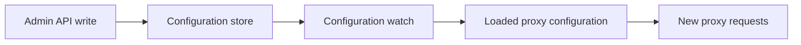

AISIX AI Gateway accepts configuration writes through the Admin API, then makes
the accepted resources visible to proxy requests after each proxy applies the
latest configuration.

Propagation follows this path:

This separation keeps proxy requests on the loaded configuration path instead
of waiting on configuration storage.

## Propagation Behavior

Propagation is asynchronous. An Admin API write can succeed before every proxy
has loaded the updated configuration.

In normal local conditions, propagation is usually visible within one watch
cycle. In shared or multi-replica environments, readiness can take longer, so
poll for the expected proxy-visible state instead of relying on a fixed delay.

After writing dependent resources such as a provider key, model, or API key,
wait for propagation before sending a production-like proxy request. This
matters most when one resource depends on another.

Use polling when possible. Poll `GET /v1/models` until the model appears for
the caller key, or poll the target proxy endpoint until a known propagation
error disappears. Use a short delay only for simple local demos. Polling is the
safest approach for automation and rollout checks.

`GET /admin/v1/health` can expose watch freshness information through the
optional `config` block when configuration freshness is available.

That block includes `snapshot_revision` and `snapshot_age_seconds`. Use these
fields to detect whether a proxy has stopped receiving configuration updates.

## Readiness Checks

Treat a successful admin write as acceptance of the resource, not immediate
proxy readiness. Prefer readiness polling in automation over `sleep`, and use
admin health to distinguish configuration-propagation problems from
proxy-request problems.

## Troubleshooting

### Admin Writes Succeed but Callers Still Get `404`

Suspect propagation first for newly created models and API keys.

### One Environment Looks Stale

Check configuration freshness and watch health rather than retrying the same
admin write repeatedly.

## Related Reading

[Admin API](admin-api.md) covers dynamic-resource management through the
standalone admin listener. For runtime signals and readiness checks, see
[Health checks](../operations/health-checks.md) and
[Testing and verification](../operations/testing-and-verification.md).
