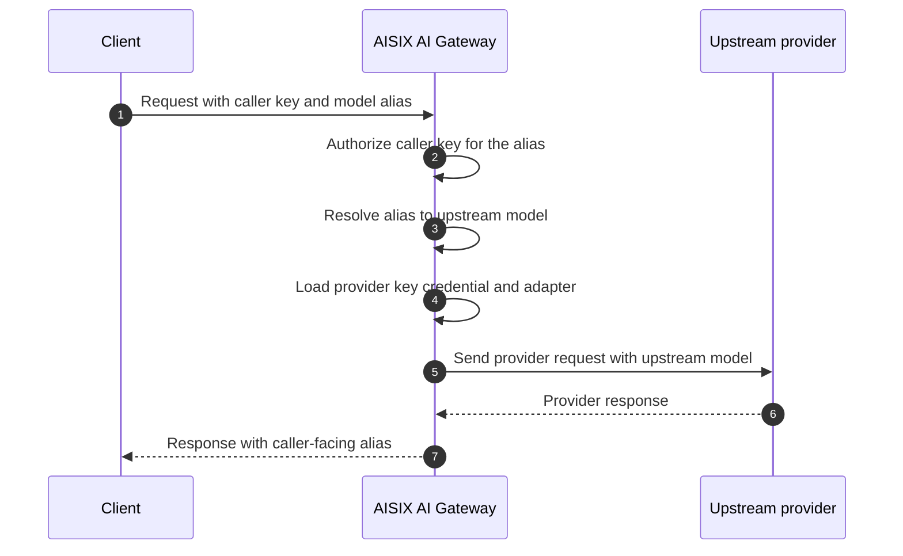

A provider upstream is the model service AISIX AI Gateway calls after it
authenticates the caller and resolves the requested model alias.

Choose the upstream setup guide that matches the provider API format your
gateway will call.

## Choose a Setup Path

Choose the adapter that matches the upstream API format, not the provider's
business category. DeepSeek and a vLLM server both use `adapter: "openai"`
because AISIX sends them OpenAI-compatible chat-completions requests.

| Upstream API Format | Examples | Setup Guide | Adapter |
| --- | --- | --- | --- |
| Public OpenAI-compatible vendor | DeepSeek, Groq, Mistral, Together.ai, Fireworks, Perplexity | [OpenAI-Compatible Vendor Upstream](upstream-openai-compat.md) | `openai` |
| Private OpenAI-compatible endpoint | vLLM, SGLang, Ollama, private model proxy | [Bring Your Own Endpoint](../configuration/byo-endpoint.md) | `openai` |
| AWS Bedrock native API | Bedrock foundation models or inference profiles | [AWS Bedrock Upstream](upstream-bedrock.md) | `bedrock` |
| Google Vertex AI native API | Vertex publisher models | [Google Vertex AI Upstream](upstream-vertex.md) | `vertex` |
| Azure OpenAI API | Azure OpenAI deployments | [Azure OpenAI Upstream](upstream-azure-openai.md) | `azure-openai` |

## Request Flow

A working model alias connects the caller API key, the model resource, and the
provider key. The caller key authorizes the alias, the model maps the alias to
the upstream model name, and the provider key supplies the credential and
adapter used for the provider request.

The client sends the caller-facing alias in `model`. AISIX rewrites that value
to the upstream `model_name` before the provider request and restores the alias
in normalized chat responses.

Each upstream family needs a credential, an upstream model value, and sometimes
a base URL. OpenAI-compatible vendors use a provider API key and vendor model
ID; non-OpenAI vendors need `api_base` unless a built-in default applies. BYO
OpenAI-compatible endpoints use a provider key credential, the served model name
or local tag, and the endpoint root, including `/v1` when the server serves
there.

Bedrock uses a JSON AWS credential with region and a Bedrock model ID or
inference profile ID. Vertex AI uses a JSON GCP credential with project and
region and a Vertex publisher model ID. Azure OpenAI uses either a resource
API-key string or JSON Entra ID credential and routes by Azure deployment name.
For Bedrock and Vertex, set `api_base` only for private or proxy endpoints; for
Azure, use the resource host, bare resource name, or override URL.

## Alias Readiness Check

Before giving the caller key to an application team, confirm that
`allowed_models` includes the alias and that `/v1/models` shows the alias for
that caller key after configuration propagation.

Send a test request through the proxy and check that `response.model` contains
the caller-facing alias, not the upstream model ID. If your provider exposes
logs, metrics, request IDs, or usage records, use them to confirm that the
request reached the intended upstream account and model.

Finally, confirm that the endpoint is supported by the selected provider
family. See [Provider Compatibility](../reference/provider-compatibility.md).

## Related Reading

Configure provider-specific upstreams with
[OpenAI-Compatible Vendor Upstream](upstream-openai-compat.md),
[Bring Your Own Endpoint](../configuration/byo-endpoint.md),
[AWS Bedrock Upstream](upstream-bedrock.md),
[Google Vertex AI Upstream](upstream-vertex.md), and
[Azure OpenAI Upstream](upstream-azure-openai.md). To compare adapter families
and upstream request behavior, see
[Adapter Protocol Families](../reference/adapters.md).
