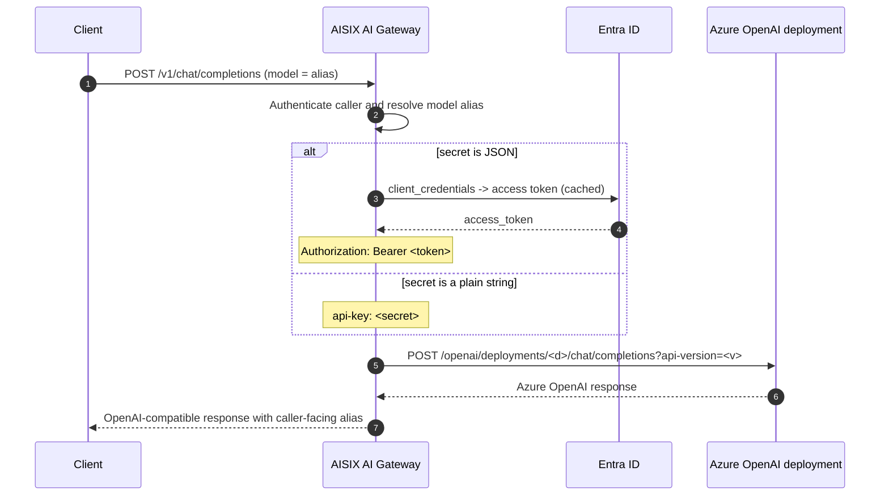

AISIX AI Gateway can route OpenAI-compatible chat requests to [Azure OpenAI Service](https://learn.microsoft.com/en-us/azure/ai-services/openai/).
Callers can reach your Azure deployments through the gateway.

Register Azure credentials, map a caller-facing alias to an Azure deployment,
and send requests through the gateway's proxy API. The provider key uses
`adapter: azure-openai`. Azure OpenAI has a deployment-based URL pattern,
Azure-specific authentication headers, and content-filter response fields.

## Use Cases

This setup is for OpenAI models that run on Azure OpenAI Service and need
gateway authentication, model allowlists, rate limiting, and usage accounting.
The Azure OpenAI adapter supports both resource API-key authentication and
Entra ID (Azure AD) `client_credentials`.

For models you host yourself, use [Bring Your Own Endpoint](../configuration/byo-endpoint.md)
instead.

## Azure Request Routing

AISIX builds the Azure chat-completions URL from the deployment name (the
model's `model_name`) and the resource (the provider key's `api_base`):

```text
https://<resource>.openai.azure.com/openai/deployments/<deployment>/chat/completions?api-version=<version>
```

The authentication scheme is detected from the provider key's `secret`
structure. A plain string uses Azure's resource-key scheme and sends
`api-key: <secret>`, without an `Authorization: Bearer` header. A JSON object
with `tenant_id`, `client_id`, and `client_secret` uses the Entra ID
`client_credentials` flow; AISIX mints an OAuth2 access token and sends
`Authorization: Bearer <token>`.

AISIX accepts Azure's `prompt_filter_results` and `content_filter_results`
response extensions, so a successful Azure response with content-filter
metadata still reaches the caller as an OpenAI-compatible chat completion.



## Prerequisites

Before you start, run the gateway with the admin API on `:3001` and the proxy
API on `:3000`, prepare your admin key from the bootstrap config, and create an
Azure OpenAI resource with a deployment. The provider key can use either the
resource API key or an Entra ID app registration with `tenant_id`, `client_id`,
and `client_secret` granted access to the resource.

Prepare the Azure OpenAI resource host or bare resource name, resource API key
or Entra ID credential, optional national-cloud authority host, Azure
deployment name, and caller-facing alias.

:::warning Production Credentials
The standalone gateway stores `secret` as plaintext under the etcd `prefix`
from [`config.yaml`](../configuration/bootstrap-config.md). For production,
protect etcd with encryption at rest and restricted network access, or use
AISIX Cloud's managed [Provider Key Rotation](../cloud/provider-key-rotation.md).
:::

## Configure the Azure Upstream

Create an Azure provider key, model alias, and caller API key. Both Azure
authentication schemes use the same model and caller-key resources; only the
provider-key `secret` differs.

### Create an Azure Provider Key

#### Use API Key Authentication

The `secret` is the resource API-key string. `api_base` is the resource host.

```shell
curl -sS -X POST http://127.0.0.1:3001/admin/v1/provider_keys \
  -H "Authorization: Bearer YOUR_ADMIN_KEY" \
  -H "Content-Type: application/json" \
  -d '{
    "display_name": "azure-prod",
    "provider": "azure",
    "adapter": "azure-openai",
    "secret": "YOUR_AZURE_API_KEY",
    "api_base": "https://acme-west.openai.azure.com"
  }'
```

#### Use Entra ID Authentication

The `secret` is a JSON object. Its `{` prefix tells the gateway to use the
Entra ID `client_credentials` flow.

```shell
curl -sS -X POST http://127.0.0.1:3001/admin/v1/provider_keys \
  -H "Authorization: Bearer YOUR_ADMIN_KEY" \
  -H "Content-Type: application/json" \
  -d '{
    "display_name": "azure-aad-prod",
    "provider": "azure",
    "adapter": "azure-openai",
    "secret": "{\"tenant_id\":\"YOUR_TENANT_ID\",\"client_id\":\"YOUR_CLIENT_ID\",\"client_secret\":\"YOUR_CLIENT_SECRET\"}",
    "api_base": "https://acme-west.openai.azure.com"
  }'
```

The Entra ID `secret` must include `tenant_id`, `client_id`, and `client_secret`.
`tenant_id` can be a tenant UUID or vanity domain. `client_secret` is the secret
value, not the secret id.

Use `authority_host` only for a national or sovereign cloud. Omit it for public
Azure, where the gateway defaults to `https://login.microsoftonline.com`. For
example, use `https://login.microsoftonline.us` for US Government or
`https://login.chinacloudapi.cn` for China, 21Vianet. The value must be a bare
HTTP(S) origin; AISIX appends the tenant and `/oauth2/v2.0/token` path.

For a national-cloud tenant, add `authority_host` to the JSON secret:

```json
{
  "tenant_id": "YOUR_TENANT_ID",
  "client_id": "YOUR_CLIENT_ID",
  "client_secret": "YOUR_CLIENT_SECRET",
  "authority_host": "https://login.microsoftonline.us"
}
```

The gateway caches minted tokens for reuse and refreshes them about 60 seconds
before their reported expiry.

For both options, set `adapter` to `azure-openai`. Use a provider label that
identifies the upstream; the example uses `azure`. Save the returned `id`
for the model resource.

#### Configure Base URL and API Version

`api_base` is the Azure resource host. AISIX accepts an Azure resource URL such
as `https://<resource>.openai.azure.com`, or a bare resource name such as
`acme-west`, and builds the Azure OpenAI resource host from that value.

For a corporate proxy, private-VPC endpoint, or test endpoint, set an exact
override URL whose host does not end in `.openai.azure.com`. The override may
include a path prefix. AISIX rejects userinfo, query strings, and fragments,
then appends
`/openai/deployments/<deployment>/chat/completions?api-version=<version>`.

The gateway uses a GA `api-version` default (`2024-10-21`). Azure deprecates
older API versions on a
[published schedule](https://learn.microsoft.com/en-us/azure/ai-services/openai/api-version-deprecation),
so track the version your deployment requires.

### Create a Model

`model_name` is the Azure deployment name, not the underlying model ID.
The caller-facing alias is `display_name`.

```shell
curl -sS -X POST http://127.0.0.1:3001/admin/v1/models \
  -H "Authorization: Bearer YOUR_ADMIN_KEY" \
  -H "Content-Type: application/json" \
  -d '{
    "display_name": "gpt-4o-azure",
    "provider": "azure",
    "model_name": "gpt4o-prod",
    "provider_key_id": "YOUR_PROVIDER_KEY_ID"
  }'
```

### Create a Caller API Key

```shell
if command -v sha256sum >/dev/null 2>&1; then
  printf '%s' 'sk-demo-caller' | sha256sum | cut -d' ' -f1
else
  printf '%s' 'sk-demo-caller' | shasum -a 256 | awk '{print $1}'
fi
```

```shell
curl -sS -X POST http://127.0.0.1:3001/admin/v1/apikeys \
  -H "Authorization: Bearer YOUR_ADMIN_KEY" \
  -H "Content-Type: application/json" \
  -d '{
    "key_hash": "YOUR_CALLER_KEY_HASH",
    "allowed_models": ["gpt-4o-azure"]
  }'
```

## Send a Test Request

Admin API writes propagate to the proxy asynchronously. If the alias is not
visible immediately, check configuration propagation and retry after the proxy
has loaded the model alias. The request is
identical regardless of which auth scheme the provider key uses.

```shell
curl -sS -X POST http://127.0.0.1:3000/v1/chat/completions \
  -H "Authorization: Bearer sk-demo-caller" \
  -H "Content-Type: application/json" \
  -d '{
    "model": "gpt-4o-azure",
    "messages": [
      {"role": "user", "content": "Say hello from Azure OpenAI."}
    ]
  }'
```

The gateway returns an OpenAI-compatible response with the caller-facing alias:

```json
{
  "id": "cmpl-azure-...",
  "object": "chat.completion",
  "model": "gpt-4o-azure",
  "choices": [
    {
      "index": 0,
      "message": {"role": "assistant", "content": "Hello from Azure OpenAI!"},
      "finish_reason": "stop"
    }
  ],
  "usage": {"prompt_tokens": 7, "completion_tokens": 5, "total_tokens": 12}
}
```

## Verify the Azure Upstream

After the test request succeeds, confirm the caller-facing alias and Azure
request.

```shell
curl -sS -X POST http://127.0.0.1:3000/v1/chat/completions \
  -H "Authorization: Bearer sk-demo-caller" \
  -H "Content-Type: application/json" \
  -d '{"model":"gpt-4o-azure","messages":[{"role":"user","content":"ping"}]}' \
  | grep -o '"model":"[^"]*"'
```

The output should be `"model":"gpt-4o-azure"`, your caller-facing alias, not
the Azure deployment name `gpt4o-prod`.

For a resource-key provider key, AISIX sends the Azure `api-key` header and
does not send an `Authorization` header. For an Entra ID provider key, AISIX
sends `Authorization: Bearer <minted-token>`.

In both cases, the outbound URL is
`/openai/deployments/<deployment>/chat/completions?api-version=<version>` with
the deployment taken from the model's `model_name`.

Check Azure OpenAI metrics, logs, or quota usage for the test request. If AISIX
returns an upstream authentication error, check the resource API key or Entra
ID credential. If it returns an upstream route error, check `api_base`, the
deployment name in `model_name`, and the configured API version.

### Content-Filter Tolerance

Azure attaches `prompt_filter_results` and `content_filter_results` blocks to
successful responses. The gateway tolerates these extension fields and returns
the standard OpenAI envelope unchanged. A content-annotated `200` from Azure
still deserializes and reaches the caller as a normal chat completion. A
request that Azure blocks for a content-policy violation is returned as an
upstream error with the Azure error code preserved for downstream translation.

## Limitations

The `api-version` default may not match every deployment. Track the version
your deployment requires and plan for Azure's deprecation schedule.

Verbatim `api_base` overrides accept any reachable host. A typo can route
traffic to wherever that host resolves, so double-check override URLs before
exposing the alias to applications.

The Entra ID path mints a token per `(tenant_id, client_id)` and caches it. A
revoked client secret returns an upstream authentication failure on the next
token mint.

## Related Reading

[Choose a Provider Upstream](provider-upstreams.md) compares upstream setup
paths, and [Adapter Protocol Families](../reference/adapters.md) shows where
Azure OpenAI fits among adapter families. Configure the credential
resource and `api_base` behavior with
[Provider Keys](../configuration/provider-keys.md). For other upstream
families, see [AWS Bedrock Upstream](upstream-bedrock.md) and
[Google Vertex AI Upstream](upstream-vertex.md).
