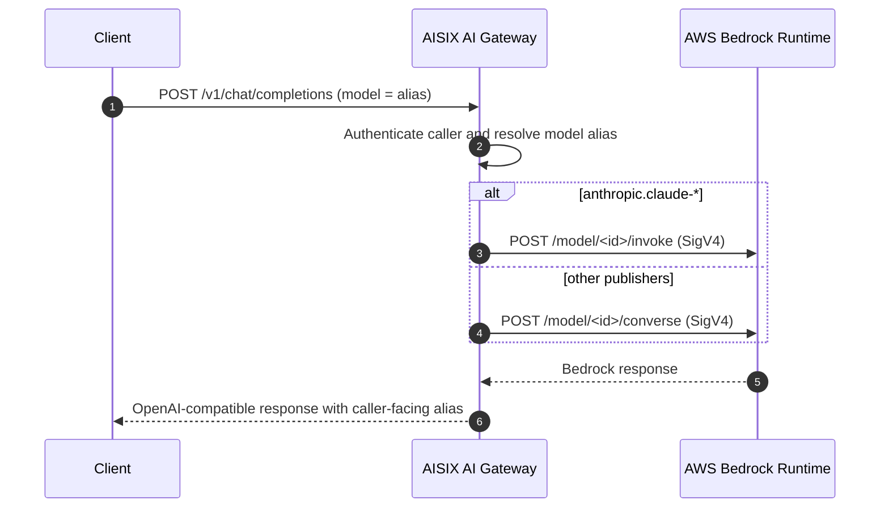

AISIX AI Gateway can route OpenAI-compatible chat requests to [AWS Bedrock](https://docs.aws.amazon.com/bedrock/).
Callers can reach Claude, Llama, Mistral, Amazon Nova, Cohere, and other
Bedrock-hosted models through the gateway.

Register Bedrock credentials, map a caller-facing alias to a Bedrock model ID,
and send requests through the gateway's proxy API. The provider key uses
`adapter: bedrock`, and AISIX signs outbound calls with AWS SigV4.

## Use Cases

This setup is for models that run on AWS Bedrock and need gateway
authentication, model allowlists, rate limiting, and usage accounting. The Bedrock
adapter also supports cross-region inference profile prefixes such as `us.`,
`eu.`, `apac.`, `global.`, and `us-gov.`.

For models you host yourself, use [Bring Your Own Endpoint](../configuration/byo-endpoint.md)
instead.

## Bedrock Request Routing

AISIX chooses the Bedrock route from the configured `model_name`.

Anthropic models such as `anthropic.claude-*` use the legacy Bedrock `/invoke`
route (`InvokeModel`) with an Anthropic Messages JSON body. Bedrock selects the
model from the URL path, so the request body does not include `model`; AISIX
also adds `anthropic_version: "bedrock-2023-05-31"`.

Other supported Bedrock publishers, including `meta.llama*`, `mistral.*`,
`amazon.titan-*`, `amazon.nova-*`, `cohere.command*`, and `ai21.jamba-*`, use
the unified [Converse API](https://docs.aws.amazon.com/bedrock/latest/APIReference/API_runtime_Converse.html)
route, `/converse`.

Authentication is AWS SigV4, computed from the credentials in the provider
key's `secret`. The model's `model_name` is the Bedrock model ID and is passed
to Bedrock unchanged, including any cross-region inference profile prefix.



## Prerequisites

Before you start, run the gateway with the admin API on `:3001` and the proxy
API on `:3000`, prepare your admin key from the bootstrap config, and create
AWS credentials with `bedrock:InvokeModel` and `bedrock:Converse` permission.
You also need access to the target Bedrock model in the selected region.

Prepare the AWS access key ID, secret access key, region, optional STS session
token, Bedrock model ID or inference profile ID, and the caller-facing alias
you want applications to use.

## Configure the Bedrock Upstream

Create a Bedrock provider key, model alias, and caller API key. The provider
key stores the AWS credential, while the model selects the Bedrock model ID or
inference profile.

### Create a Bedrock Provider Key

The `secret` is a JSON-encoded AWS credential. The base URL is not part of the
secret. Leave `api_base` unset for standard AWS, or set it to a private
Bedrock endpoint (VPC endpoint) if you have one.

:::warning Production Credentials
The standalone gateway stores `secret` as plaintext under the etcd `prefix`
from [`config.yaml`](../configuration/bootstrap-config.md). For production,
protect etcd with encryption at rest and restricted network access, or use
AISIX Cloud's managed [Provider Key Rotation](../cloud/provider-key-rotation.md).
:::

```shell
curl -sS -X POST http://127.0.0.1:3001/admin/v1/provider_keys \
  -H "Authorization: Bearer YOUR_ADMIN_KEY" \
  -H "Content-Type: application/json" \
  -d '{
    "display_name": "bedrock-prod",
    "provider": "amazon-bedrock",
    "adapter": "bedrock",
    "secret": "{\"access_key_id\":\"YOUR_AWS_ACCESS_KEY_ID\",\"secret_access_key\":\"YOUR_AWS_SECRET_ACCESS_KEY\",\"region\":\"us-west-2\"}"
  }'
```

The `secret` value is a JSON string. It must include `access_key_id`,
`secret_access_key`, and `region`. Bedrock's endpoint is region-keyed, for
example `bedrock-runtime.us-west-2.amazonaws.com`, so the region is required.

Include `session_token` when you use temporary STS credentials. Omit it for
long-lived static keys.

Set `adapter` to `bedrock`. Use a provider label that identifies the upstream;
the example uses `amazon-bedrock`.

Save the returned `id` for the model resource.

### Create a Model

`model_name` is the Bedrock model ID. The caller-facing alias is `display_name`.

```shell
curl -sS -X POST http://127.0.0.1:3001/admin/v1/models \
  -H "Authorization: Bearer YOUR_ADMIN_KEY" \
  -H "Content-Type: application/json" \
  -d '{
    "display_name": "claude-bedrock",
    "provider": "amazon-bedrock",
    "model_name": "anthropic.claude-3-5-sonnet-20241022-v2:0",
    "provider_key_id": "YOUR_PROVIDER_KEY_ID"
  }'
```

For a Converse-path model, set `model_name` to the publisher's Bedrock ID, for
example `meta.llama3-3-70b-instruct-v1:0` or `amazon.nova-pro-v1:0`.

### Use Cross-Region Inference Profiles

To use a
[cross-region inference profile](https://docs.aws.amazon.com/bedrock/latest/userguide/cross-region-inference.html),
prefix the model ID with the geography (`us.`, `eu.`, `apac.`, `global.`, or
`us-gov.`):

```json
{
  "model_name": "us.anthropic.claude-3-5-sonnet-20241022-v2:0"
}
```

The gateway uses the prefix only to resolve the publisher; the full prefixed ID
is passed to Bedrock unchanged on the outbound call.

### Create a Caller API Key

```shell
if command -v sha256sum >/dev/null 2>&1; then
  printf '%s' 'sk-demo-caller' | sha256sum | cut -d' ' -f1
else
  printf '%s' 'sk-demo-caller' | shasum -a 256 | awk '{print $1}'
fi
```

```shell
curl -sS -X POST http://127.0.0.1:3001/admin/v1/apikeys \
  -H "Authorization: Bearer YOUR_ADMIN_KEY" \
  -H "Content-Type: application/json" \
  -d '{
    "key_hash": "YOUR_CALLER_KEY_HASH",
    "allowed_models": ["claude-bedrock"]
  }'
```

## Send a Test Request

Admin API writes propagate to the proxy asynchronously. If the alias is not
visible immediately, check configuration propagation and retry after the proxy
has loaded the model alias.

```shell
curl -sS -X POST http://127.0.0.1:3000/v1/chat/completions \
  -H "Authorization: Bearer sk-demo-caller" \
  -H "Content-Type: application/json" \
  -d '{
    "model": "claude-bedrock",
    "messages": [
      {"role": "user", "content": "Say hello from Bedrock."}
    ]
  }'
```

The gateway returns an OpenAI-compatible response with the caller-facing alias:

```json
{
  "id": "msg_01...",
  "object": "chat.completion",
  "model": "claude-bedrock",
  "choices": [
    {
      "index": 0,
      "message": {"role": "assistant", "content": "Hello from Bedrock!"},
      "finish_reason": "stop"
    }
  ],
  "usage": {"prompt_tokens": 9, "completion_tokens": 5, "total_tokens": 14}
}
```

## Verify the Bedrock Upstream

After the test request succeeds, confirm the caller-facing alias and Bedrock
request.

```shell
curl -sS -X POST http://127.0.0.1:3000/v1/chat/completions \
  -H "Authorization: Bearer sk-demo-caller" \
  -H "Content-Type: application/json" \
  -d '{"model":"claude-bedrock","messages":[{"role":"user","content":"ping"}]}' \
  | grep -o '"model":"[^"]*"'
```

The output should be `"model":"claude-bedrock"`, your caller-facing alias,
not `anthropic.claude-3-5-sonnet-20241022-v2:0`.

AISIX signs Bedrock requests with
`Authorization: AWS4-HMAC-SHA256 Credential=...`, not a bearer token. It calls
`/model/<modelId>/converse` for Converse-path publishers, or
`/model/<modelId>/invoke` for `anthropic.*`.

Check Bedrock invocation metrics, CloudTrail, or provider-side logs for the
test request. If AISIX returns an upstream authentication or authorization
error, check the AWS credential, region, IAM permissions, and Bedrock model
access.

## Limitations

Streaming uses the Converse stream API (`/converse-stream`) for all supported
publishers. Confirm streaming behavior against your specific publisher before
exposing it to applications.

Anthropic on Bedrock uses the legacy `/invoke` route for non-streaming chat to
preserve the Anthropic Messages body format. Other supported publishers use
Converse.

Converse-path publishers require at least one user or assistant turn. AISIX
rejects system-only requests before the provider request because Bedrock
Converse does not accept an empty `messages` array.

Upstream error detail from AWS is redacted in the caller-visible error to avoid
leaking AWS identifiers such as ARNs, region, and account ID.

## Related Reading

[Choose a Provider Upstream](provider-upstreams.md) compares setup paths, and
[Adapter Protocol Families](../reference/adapters.md) shows where Bedrock fits
among adapter families. Configure credentials with
[Provider Keys](../configuration/provider-keys.md), and review caller traffic
in [OpenAI-compatible API](openai-compatible-api.md). For other upstream
families, see [Google Vertex AI Upstream](upstream-vertex.md) and
[Azure OpenAI Upstream](upstream-azure-openai.md).
