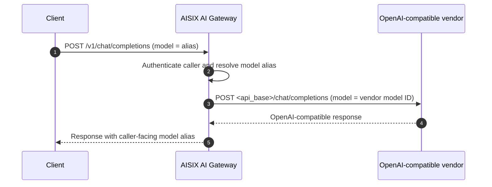

AISIX AI Gateway can route OpenAI-compatible chat requests to public model
vendors such as DeepSeek, Groq, Mistral, Together.ai, Fireworks, and
Perplexity.

Applications keep using the gateway's OpenAI-compatible API. AISIX stores the
vendor credential, sends each request to the configured vendor host, and
returns the response through the caller-facing model alias.

## When to Use This Setup

This setup is for public vendors that expose an OpenAI-compatible
chat-completions API, such as
`https://api.deepseek.com` or `https://api.groq.com/openai/v1`.

For private or self-hosted OpenAI-compatible servers, use
[Bring Your Own Endpoint](../configuration/byo-endpoint.md) instead. For the
client-facing API your applications call, see
[OpenAI-compatible API](openai-compatible-api.md).

## How AISIX Routes Vendor Requests

An OpenAI-compatible vendor setup connects three gateway resources:

| Resource | Configure | Purpose |
| --- | --- | --- |
| Provider key | Vendor credential, `adapter: "openai"`, and `api_base` | Gives AISIX the credential and host for the vendor request. |
| Model | Caller-facing `display_name` and vendor `model_name` | Maps the model alias used by callers to the model ID expected by the vendor. |
| Caller API key | `allowed_models` | Allows an application key to call the model alias through AISIX. |

Set `api_base` for every non-OpenAI public vendor. AISIX only has a built-in
default for the OpenAI provider itself; it does not guess the base URL for
DeepSeek, Groq, Mistral, Together.ai, Fireworks, Perplexity, or another vendor.
Without `api_base`, the gateway cannot know which vendor host should receive
the request.

Use the base URL from the provider's API reference. Some vendors serve
OpenAI-compatible paths at the host root, while others include `/v1` or
`/openai/v1`. See
[Provider Keys](../configuration/provider-keys.md#configure-the-base-url) for
base URL guidance and
[Base URL Normalization](../configuration/provider-keys.md#base-url-normalization)
for the normalization rules.

After the resources are in place, a request follows this path:



## Prerequisites

Before you start, run the gateway with the admin API on `:3001` and the proxy
API on `:3000`. Prepare your admin key from the bootstrap configuration, and
collect the vendor API key, model ID, and OpenAI-compatible base URL from the
provider's API reference.

The examples below use DeepSeek with `https://api.deepseek.com` and
`deepseek-chat`.

## Configure the Vendor Upstream

Create a provider key, model alias, and caller API key. Together, these
resources let a caller send the AISIX model alias while the gateway sends the
vendor model ID and credential upstream.

### Create a Provider Key

:::warning Production Credentials
The standalone gateway stores `secret` as plaintext under the etcd `prefix`
from [`config.yaml`](../configuration/bootstrap-config.md). For production,
protect etcd with encryption at rest and restricted network access, or use
AISIX Cloud's managed [Provider Key Rotation](../cloud/provider-key-rotation.md).
:::

```shell
curl -sS -X POST http://127.0.0.1:3001/admin/v1/provider_keys \
  -H "Authorization: Bearer YOUR_ADMIN_KEY" \
  -H "Content-Type: application/json" \
  -d '{
    "display_name": "deepseek-prod",
    "provider": "deepseek",
    "adapter": "openai",
    "secret": "YOUR_PROVIDER_API_KEY",
    "api_base": "https://api.deepseek.com"
  }'
```

Use a provider label that identifies the vendor, such as `deepseek`, `groq`,
`mistral`, `together`, `fireworks`, or `perplexity`. Keep `adapter` set to
`openai`, and set `provider` to the actual vendor identity unless the upstream
is OpenAI itself.

Set `api_base` to the provider's OpenAI-compatible base URL. For another
vendor, replace both `api_base` and `model_name` with values from that
provider's API reference. Save the returned provider key `id`.

### Create a Model

Map a caller-facing alias to the vendor's model ID.

```shell
curl -sS -X POST http://127.0.0.1:3001/admin/v1/models \
  -H "Authorization: Bearer YOUR_ADMIN_KEY" \
  -H "Content-Type: application/json" \
  -d '{
    "display_name": "deepseek-chat-prod",
    "provider": "deepseek",
    "model_name": "deepseek-chat",
    "provider_key_id": "YOUR_PROVIDER_KEY_ID"
  }'
```

`display_name` is the alias callers send in `model` and the value
`response.model` echoes back. `model_name` is the vendor's model ID, which is
the literal string the vendor expects in its `model` field. The model `provider`
uses the same vendor label as the provider key.

`cost` is optional. Add a `cost` block only when you need budget accounting or
usage reports to calculate token cost for this alias. See
[Models](../configuration/models.md#cost-metadata).

### Create a Caller API Key

The gateway stores `key_hash`, not the plaintext caller key. Hash a plaintext
caller key, then create the key resource scoped to the new alias.

```shell
if command -v sha256sum >/dev/null 2>&1; then
  printf '%s' 'sk-demo-caller' | sha256sum | cut -d' ' -f1
else
  printf '%s' 'sk-demo-caller' | shasum -a 256 | awk '{print $1}'
fi
```

```shell
curl -sS -X POST http://127.0.0.1:3001/admin/v1/apikeys \
  -H "Authorization: Bearer YOUR_ADMIN_KEY" \
  -H "Content-Type: application/json" \
  -d '{
    "key_hash": "YOUR_CALLER_KEY_HASH",
    "allowed_models": ["deepseek-chat-prod"]
  }'
```

## Send a Test Request

Admin API writes propagate to the proxy asynchronously. If the alias is not
visible immediately, check configuration propagation and retry after the proxy
has loaded the updated model alias.

```shell
curl -sS -X POST http://127.0.0.1:3000/v1/chat/completions \
  -H "Authorization: Bearer sk-demo-caller" \
  -H "Content-Type: application/json" \
  -d '{
    "model": "deepseek-chat-prod",
    "messages": [
      {"role": "user", "content": "Say hello from DeepSeek."}
    ]
  }'
```

Self-hosted deployments require the provider-key fields shown above. In AISIX
Cloud, select the provider in the AISIX Cloud web console. The managed control
plane sets the adapter and base URL for catalog providers.

## Verify the Upstream

After the test request succeeds, confirm that callers see the AISIX model alias:

```shell
curl -sS -X POST http://127.0.0.1:3000/v1/chat/completions \
  -H "Authorization: Bearer sk-demo-caller" \
  -H "Content-Type: application/json" \
  -d '{"model":"deepseek-chat-prod","messages":[{"role":"user","content":"ping"}]}' \
  | grep -o '"model":"[^"]*"'
```

The output should be `"model":"deepseek-chat-prod"`, your caller-facing
alias, not the upstream `deepseek-chat`. If the vendor's model ID appears
instead, check that the request is using the AISIX proxy URL and that the caller
key is allowed to use the `deepseek-chat-prod` alias.

Check the vendor console, logs, or usage counters for the test request. If
your vendor exposes request ids or usage records, use them to confirm that the
request reached the intended account and model.

If the gateway returns an upstream authentication error, check the provider
key's `secret`. If it returns an upstream route error, check `api_base` and the
vendor model ID in `model_name`.

## Limitations

This setup is for vendors that accept OpenAI chat-completions requests. A
vendor with a different request format needs a native adapter. See
[Adapter Protocol Families](../reference/adapters.md).

For non-OpenAI vendors, always set `api_base`. A non-`openai` provider key
without `api_base` cannot reach the vendor because AISIX has no host to call.

Vendor-specific response extensions beyond the OpenAI envelope are not
normalized by default. Reasoning-style fields can be lifted per key through the
`response.reasoning_field` override. See
[Provider Key Schema Runtime Overrides](../reference/provider-key-schema.md#runtime-overrides).

## Related Reading

[Choose a Provider Upstream](provider-upstreams.md) compares upstream setup
paths, and [Adapter Protocol Families](../reference/adapters.md) explains why
OpenAI-compatible vendors use the `openai` adapter. Apply the
same mechanics to private endpoints with
[Bring Your Own Endpoint](../configuration/byo-endpoint.md). For credential
fields, base URL behavior, and caller traffic, see
[Provider Keys](../configuration/provider-keys.md),
[Provider Key Schema](../reference/provider-key-schema.md), and
[OpenAI-compatible API](openai-compatible-api.md).
