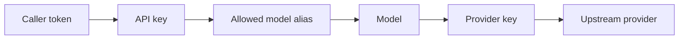

AISIX AI Gateway uses a small set of resources to turn a caller request into an
authenticated upstream provider request. The main relationship is the path from
caller credential to model alias, provider key, and upstream model.

The [Quickstart](../quickstart) creates the same resource path shown here.
Configuration guides cover setup workflows, and reference pages cover field
definitions and request formats.

## Request Path

If you completed the quickstart, the request path maps to these resources:

The caller sends the plaintext bearer token, such as `sk-demo-caller`. AISIX
hashes that value and compares it with the stored `ApiKey.key_hash`. The API
key also limits which model aliases the caller can use.

The caller-facing alias, such as `gpt-4o-prod`, resolves to a `Model` resource.
A direct model maps the alias to an upstream model and references a provider
key. The provider key, such as `openai-upstream`, stores the upstream credential
and adapter settings used for the provider-authenticated request.

## Traffic Resources

Most gateway setup starts with three resources.

### Model

A `Model` is the name callers send in the request's `model` field.

For a direct model, `display_name` is the caller-facing alias and `model_name` is
the upstream provider's model ID. This is the most important distinction in the
resource model: callers should not need to know whether `prod-chat` maps to
`gpt-4o`, a DeepSeek model, a private vLLM model, or a routing group.

A direct model also references a `ProviderKey` through `provider_key_id`. Timeout
settings, inline rate limits, health-check behavior, cooldown behavior, and cost
metadata can be attached to the model when you need them.

See [Models](../configuration/models.md).

### Provider Key

A `ProviderKey` stores the upstream credential and connection settings.

It keeps secrets out of model definitions and lets multiple models reuse the
same upstream credential. The provider key also tells the gateway which upstream
API format to use through `adapter`, such as `openai`, `anthropic`, `bedrock`,
`vertex`, or `azure-openai`.

Provider identity and adapter family are not the same thing. For example, a
DeepSeek or private vLLM endpoint can use the OpenAI-compatible API format
without pretending to be OpenAI.

See [Provider keys](../configuration/provider-keys.md).

### API Key

An `ApiKey` is the caller credential.

The proxy never stores the plaintext caller token in the API key resource. It
hashes the incoming bearer token and compares it with `key_hash`. The rotate
endpoint returns a generated plaintext key exactly once; later reads only expose
the hash.

`allowed_models` controls model access. An empty list denies access to every
model. A wildcard entry, `"*"`, allows access to every model in scope.

The runtime API key row can also carry `team_id` and `user_id`. These are bucket
identifiers for team-scoped and member-scoped policy and metrics. They are not
access controls by themselves.

See [API keys](../configuration/api-keys.md).

## Routing Models

A routing model is a model alias backed by a `routing` block instead of a
single upstream provider model.

Callers still send one stable alias. At request time, AISIX chooses a target
model using the configured strategy:

`failover` tries targets in priority order. `round_robin` rotates traffic
across targets. `weighted` selects targets according to configured weights.

Routing models are useful when you want to change upstream selection without
changing application code.

See [Routing and failover](../configuration/routing-and-failover.md).

## Policy Resources

Policy resources add gateway behavior around the key-model-provider path.

### Rate-Limit Policy

A `RateLimitPolicy` is a standalone rate-limit rule. It can match an API key,
model, team, or member identity, and it is enforced alongside inline API-key and
model limits.

Any matching layer can reject a request with `429`.

See [Rate limits](../configuration/rate-limits.md).

### Guardrail

A `Guardrail` checks request or response content.

Keyword guardrails run locally in the data plane. Bedrock and Azure Content
Safety guardrails use remote provider services, so they require credentials,
network reachability, and an explicit outage posture.

See [Guardrails](../configuration/guardrails.md).

### Cache Policy

A `CachePolicy` controls prompt-response cache lookup and storage.

Cache policy matching can apply globally, to a caller-facing model alias, or to
an API key entry. The process-level cache backend is selected from bootstrap
configuration; the policy schema includes a `backend` field, but that field does
not switch the runtime backend per policy.

See [Caching](../configuration/caching.md).

### Observability Exporter

An `ObservabilityExporter` sends gateway trace data to an OTLP/HTTP-compatible
backend.

Exporter traffic is sent by the data plane. It is metadata-oriented gateway
telemetry, not prompt or response body export.

See [Observability exporters](../configuration/observability-exporters.md).

## Managed Concepts

AISIX Cloud adds managed control-plane concepts around the gateway runtime.

### Environment

An environment scopes the resources projected to a managed data plane. Projection
rules ensure a data plane only receives the resources intended for that
environment.

### Managed Data Plane

A managed data plane still runs AISIX AI Gateway, but it is operated through the
AISIX Cloud control plane.

In managed mode, the standalone admin listener is not exposed as the local
write path. Dynamic resources come from the Cloud-managed configuration path,
and control-plane communication uses mTLS-authenticated `/dp/*` endpoints.

### Playground

The standalone gateway playground is mounted on the admin listener and forwards
requests through the local proxy router. It uses a proxy API key, not the admin
key, and the proxy middleware stack still runs.

The AISIX Cloud playground is a control-plane feature. Do not assume Cloud
playground behavior is identical to managed data-plane traffic unless the
specific feature says so.

## Related Reading

Configure the main traffic resources with
[Provider keys](../configuration/provider-keys.md),
[Models](../configuration/models.md), and
[API keys](../configuration/api-keys.md). For traffic control and virtual
model routing, see [Rate limits](../configuration/rate-limits.md) and
[Routing and failover](../configuration/routing-and-failover.md). For exact
admin routes and resource schemas, see the
[Admin API reference](/ai-gateway/reference/admin-api) and
[Resource schemas](../reference/resource-schemas.md).
