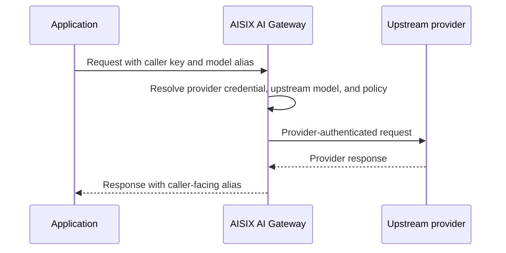

AISIX AI Gateway is a dedicated AI traffic gateway that sits between
applications and upstream model providers.

Applications call AISIX with a gateway-issued API key and a model alias.
Gateway configuration controls upstream provider credentials, model mapping,
routing, rate limits, guardrails, cache, and observability.

The first request through AISIX uses the same operating model as production
traffic: the caller sends a gateway-issued key and a model alias, while AISIX
resolves the provider credential, upstream model, and policy. If you have not
run the gateway yet, start with the [Quickstart](../quickstart) first.

## Why Use AISIX

AI traffic often starts as direct provider integration: an application stores a
provider key, chooses a provider model ID, and calls that provider's API.

That can work for one application. It becomes harder to operate when many
applications need shared credentials, shared policy, provider failover,
observability, or model changes that should not require application redeploys.

AISIX gives applications one stable gateway entry point:

Callers send a model alias such as `prod-chat`. The gateway configuration
decides which upstream provider, credential, model ID, and policy that alias
uses.

Use AISIX when AI traffic needs centrally managed credentials, aliases, policy,
and provider routing. If one application calls one provider directly and does
not need shared keys, shared policy, or provider abstraction, a direct provider
integration may be enough.

## How Requests Work

At request time, AISIX authenticates the caller key, checks whether that key can
use the requested model alias, resolves the alias to provider-side
configuration, applies gateway policy, and forwards the provider request
upstream.

Policy can include routing, rate limits, guardrails, cache, and observability.
The exact policy path depends on the resources attached to the key, model, and
deployment mode.

The main operating pattern is separation of concerns: applications use stable
model aliases and gateway API keys, while provider choice and policy stay
centralized at the gateway.

For the resource-by-resource model, see [Core concepts](core-concepts.md).

## What You Configure

Most AISIX setup starts with a provider key, a model, and an API key. The
provider key stores the upstream credential, provider identity, adapter family,
and connection details. The model defines the caller-facing alias and how that
alias resolves to an upstream model or routing group. The API key authenticates
callers and controls which model aliases they can use.

After the initial request path is in place, the gateway can add routing, failover,
rate limits, budgets, guardrails, response caching, and observability without
changing application code.

## Operating Model

AISIX has different API surfaces and deployment modes depending on whether you
run it as a standalone self-hosted gateway or as an AISIX Cloud managed data
plane.

### Proxy and Admin APIs

A self-hosted AISIX gateway exposes two primary APIs.

**Proxy API**

Applications and services use the proxy API. It accepts OpenAI-compatible
requests, Anthropic-style requests, and provider passthrough requests. The
gateway authenticates the caller, resolves the model alias, applies policy, and
forwards the request upstream.

**Admin API**

Self-hosted deployments use the admin API to manage gateway resources such as
models, API keys, provider keys, guardrails, cache policies, observability
exporters, health checks, and OpenAPI discovery.

In managed deployments, AISIX Cloud acts as the control plane. The data plane
still exposes the proxy API, but the standalone admin listener is not exposed as
the local write path. Cloud users manage environments, certificates, and
configuration projection through AISIX Cloud instead.

For exact route coverage, see the
[Proxy API reference](../reference/proxy-api-reference.md) and
[Admin API reference](/ai-gateway/reference/admin-api).

### Deployment Modes

AISIX can run in two operating modes.

In self-hosted mode, you run the gateway and manage bootstrap configuration,
etcd, dynamic resources, provider credentials, and upgrades. In managed
data-plane mode, AISIX Cloud manages environments, certificates, and
configuration projection while the gateway data plane still handles traffic.

See [Deployment modes](deployment-modes.md) for the comparison.

### Provider and Endpoint Support

AISIX supports multiple upstream protocol families and provider integrations.
Provider support is not identical across every endpoint or provider family.

For example, a model can work on the broad OpenAI-compatible chat route and
still be rejected on an endpoint that requires a narrower provider-native API.

Check [Feature availability](feature-matrix.md) when planning production use,
and [Provider compatibility](../reference/provider-compatibility.md) when
matching providers to caller-facing endpoints.

### Relationship to APISIX AI Plugins

Apache APISIX can proxy AI traffic on normal gateway routes through AI plugins.
That path is useful when an AI call is one route in a broader API gateway
deployment.

AISIX is different because AI traffic is the gateway's primary responsibility.
It models provider keys, model aliases, caller API keys, routing, rate limits,
cache, guardrails, and observability as AI gateway resources.

Choose the APISIX AI plugin path when AI behavior belongs to an existing API
gateway route. Choose AISIX when the main operating concern is AI traffic
itself: provider credentials, model aliases, model access, routing, failover,
policy, and AI request telemetry.

### AISIX Gateway and AISIX Cloud

`AISIX AI Gateway` is the gateway runtime. `AISIX Cloud` adds managed
environment management, certificate issuance, configuration projection, usage
events, and Cloud-specific workflows.

## Related Reading

For the resource model, see [Core concepts](core-concepts.md). To compare
self-hosted and AISIX Cloud operation, see
[Deployment modes](deployment-modes.md). Before planning production use, check
[Feature availability](feature-matrix.md) and the default caller-facing
[OpenAI-compatible API](../integration/openai-compatible-api.md).
