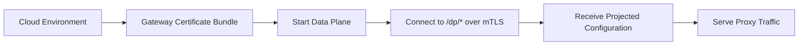

Connect an AISIX AI Gateway data plane to AISIX Cloud with a gateway
certificate bundle and mTLS. The data plane receives Cloud-projected
configuration and serves proxy traffic without exposing the standalone admin
API.

:::note
AISIX Cloud handles environment creation, certificate issuance, and management
workflows. The bootstrap instructions below cover data-plane runtime startup.
:::

## Prerequisites

Before you start, prepare an AISIX Cloud environment, a gateway certificate
bundle issued for that environment, the AISIX AI Gateway container image or
binary, a writable runtime state directory such as `/var/lib/aisix`, and
network access from the data plane to the AISIX Cloud data-plane-manager
endpoint.

## Bootstrap Model

Managed bootstrap is certificate-based.



The `/dp/*` endpoints are mTLS-authenticated. The older `/dp/register`
bearer-token pattern is not used for this bootstrap path.

When debugging bootstrap failures, check for a certificate bundle and mTLS
connection settings rather than a bearer registration token.

## Prepare Bootstrap Inputs

Collect the certificate bundle, Cloud endpoint, config selection, and runtime
state path before starting the data plane.

### Certificate Bundle

The control plane issues a gateway certificate bundle for the target
environment. The bundle contains a client certificate PEM, a private key PEM,
and a CA bundle PEM.

The bundle is environment-scoped. The data plane uses it to authenticate to the
AISIX Cloud data-plane manager and to derive the managed environment scope used
for projected configuration.

### Runtime Inputs

In managed mode, the data plane starts with the Cloud data-plane-manager base
URL in `AISIX_MANAGED__CP_BASE_URL`, the client certificate in
`AISIX_MANAGED__CP_CERT_PEM`, the private key in
`AISIX_MANAGED__CP_KEY_PEM`, and the CA bundle in
`AISIX_MANAGED__CP_CA_PEM`.

`AISIX_MANAGED__CP_BASE_URL` must point to the Cloud data-plane-manager `/dp/*`
mTLS endpoints, for example `https://dpm.example.com:7944` or
`https://dpm:7944` inside the AISIX Cloud Compose network.

Do not point `AISIX_MANAGED__CP_BASE_URL` at the AISIX Cloud web console or
the control-plane API origin such as `http://api:8080`. The heartbeat URL is
always built as `<CP_BASE_URL>/dp/heartbeat`, so a wrong base URL usually shows
up as `/dp/heartbeat` returning `404`.

`AISIX_MANAGED__CP_ETCD_ENDPOINT` is **optional** and most deployments should
leave it unset. When it is not provided, the data plane derives the etcd
endpoint from `CP_BASE_URL` because the control plane multiplexes the REST and
etcd gRPC endpoints on the same `host:port`.

Set `AISIX_MANAGED__CP_ETCD_ENDPOINT` only when your control plane serves etcd
on a different `host:port` than the `/dp/*` REST endpoints. Managing the
control plane's etcd endpoint is not part of the normal Cloud user workflow.

### Managed Config

The published container image selects the config file through
`AISIX_CONFIG_PATH`. The default is `/etc/aisix/config.yaml`.

For a managed data plane, point the entrypoint at the baked managed config:

```shell
AISIX_CONFIG_PATH=/etc/aisix/config.managed.yaml
```

`AISIX_CONFIG_PATH` is read by the container entrypoint and is unset before the
binary starts. When you run the binary directly, use the equivalent `--config`
flag or `AISIX_CONFIG` environment variable:

```shell
aisix --config /path/to/config.managed.yaml
```

or:

```shell
AISIX_CONFIG=/path/to/config.managed.yaml aisix
```

### Certificate Files

For deployments that should not inline PEM material into environment
variables, use the file-based equivalents:
`AISIX_MANAGED__CP_CERT_FILE`, `AISIX_MANAGED__CP_KEY_FILE`, and
`AISIX_MANAGED__CP_CA_FILE`.

The inline and file variants are mutually exclusive for each cert/key/CA pair.

## Start the Data Plane

A managed data plane usually starts from the published container image with the
managed config selected and the certificate bundle supplied by environment
variables or mounted files.

Use this command pattern:

```shell
docker run --rm \
  -e AISIX_CONFIG_PATH=/etc/aisix/config.managed.yaml \
  -e AISIX_MANAGED__CP_BASE_URL="https://dpm.example.com:7944" \
  -e AISIX_MANAGED__CP_CERT_FILE="/etc/aisix/mtls/client.crt" \
  -e AISIX_MANAGED__CP_KEY_FILE="/etc/aisix/mtls/client.key" \
  -e AISIX_MANAGED__CP_CA_FILE="/etc/aisix/mtls/ca.crt" \
  -v "$PWD/mtls:/etc/aisix/mtls:ro" \
  -v aisix-state:/var/lib/aisix \
  ghcr.io/api7/ai-gateway:dev
```

Replace the example URL, certificate paths, and image tag with the values issued
for your environment. If you use inline PEM values instead of files, provide
`AISIX_MANAGED__CP_CERT_PEM`, `AISIX_MANAGED__CP_KEY_PEM`, and
`AISIX_MANAGED__CP_CA_PEM` together.

The data plane persists the issued mTLS bundle, `dp_id`, and runtime state under
`/var/lib/aisix` by default. If the container runs as a non-default user and
reads bind-mounted PEM files, make `/var/lib/aisix` writable by that same user,
for example by mounting a host-owned state directory there.

Mounting only the `mtls` subdirectory is not enough because the process also
writes sidecar files next to it.

## Managed Mode Behavior

The managed data plane uses the same `aisix` binary as standalone mode, but it
follows the managed bootstrap path instead of binding the standalone admin API.

Standalone mode accepts local admin writes on `:3001`. Managed mode expects
control-plane projection and mTLS-authenticated control-plane coordination.

When `managed.enabled` is true, the standalone admin API and Playground are not
bound. Cloud-owned resources are projected to the data plane instead of being
created through the local admin API.

The Cloud data-plane-manager API receives heartbeat, telemetry, certificate
rotation, and managed budget-check traffic from the data plane over the mTLS
connection.

## Cloud Workflows

Manage environment creation, certificate rotation, billing, and usage-event
details in AISIX Cloud. The data-plane bootstrap path stays focused on
connection, certificate, and runtime checks.

## Troubleshooting

### The Data Plane Never Becomes Healthy

Check the certificate bundle, `AISIX_MANAGED__CP_BASE_URL`, the trust chain in
`AISIX_MANAGED__CP_CA_PEM` or `AISIX_MANAGED__CP_CA_FILE`, and write access to
`/var/lib/aisix`. If you set `AISIX_MANAGED__CP_ETCD_ENDPOINT` explicitly,
verify that value as well.

If logs show `/dp/heartbeat` returning `404`, `CP_BASE_URL` usually points at
the wrong service. It should point at the data-plane-manager mTLS endpoint, not
the control-plane API or web console origin.

### The Data Plane Starts but Does Not Receive Configuration

Focus on control-plane projection and environment-scoped resource visibility.
Managed mode uses Cloud-managed configuration rather than the standalone admin
API.

## Related Reading

For certificate issuance and bootstrap details, see
[Gateway certificates and managed data plane](../cloud/gateway-certificates-and-managed-dp.md).
For managed control-plane workflow, resource projection, and cached
configuration during connectivity loss, see [AISIX Cloud overview](../cloud/overview.md),
[Resource projection](../cloud/resource-projection.md), and
[Offline resilience](../cloud/offline-resilience.md).
