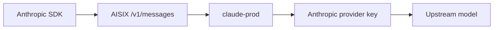

Point an Anthropic-style SDK client at AISIX AI Gateway.

Call AISIX from the Anthropic SDK when your application already uses
Claude-style request and response formats. The setup adds an Anthropic-backed
model alias to the local gateway, allows the quickstart caller key to use it,
and calls `POST /v1/messages` through the Anthropic Python SDK.

If your application is already built around OpenAI SDKs, use
[OpenAI SDK Quickstart](openai-sdk.md) instead.

## Prerequisites

Before you start, run the gateway from the [Quickstart](../quickstart) and
prepare the quickstart admin key and caller key. The examples use
`admin-local-only-change-me` and `sk-demo-caller`. You also need an Anthropic
API key, Python 3.8 or later, and `curl` plus `jq` for creating and verifying
the example alias.

The main quickstart creates an OpenAI-backed alias named `gpt-4o-prod`. This
quickstart adds a second alias, `claude-prod`, backed by Anthropic.

## What Changes in Your Application

Keep the Anthropic SDK client, but send requests through the gateway instead of
calling Anthropic directly:



The application sends the AISIX caller key `sk-demo-caller`, the AISIX model
alias `claude-prod`, and the gateway base URL `http://127.0.0.1:3000`.

AISIX resolves `claude-prod` to the upstream Anthropic model and injects the
stored provider credential on the upstream side.

## Configure the Gateway

Create an Anthropic provider key, add a `claude-prod` model alias, and allow
the quickstart caller key to use that alias.

### Set Environment Variables

Export the values used by the admin commands:

```shell
export AISIX_ADMIN_KEY="admin-local-only-change-me"
export CALLER_KEY="sk-demo-caller"
export ANTHROPIC_API_KEY="YOUR_ANTHROPIC_API_KEY"
export ANTHROPIC_MODEL="claude-sonnet-4-6"
export AISIX_ANTHROPIC_ALIAS="claude-prod"
```

Replace `YOUR_ANTHROPIC_API_KEY` with a real Anthropic API key.

`ANTHROPIC_MODEL` is the upstream model ID AISIX sends to Anthropic.
`AISIX_ANTHROPIC_ALIAS` is the caller-facing model name your application sends
to AISIX.

### Find the API Key Resource

If you are reusing the quickstart caller key, recover the matching API key
resource from the admin API:

```shell
if command -v sha256sum >/dev/null 2>&1; then
  CALLER_KEY_HASH=$(printf '%s' "${CALLER_KEY}" | sha256sum | cut -d' ' -f1)
else
  CALLER_KEY_HASH=$(printf '%s' "${CALLER_KEY}" | shasum -a 256 | awk '{print $1}')
fi

APIKEY_ID=$(curl -sS http://127.0.0.1:3001/admin/v1/apikeys \
  -H "Authorization: Bearer ${AISIX_ADMIN_KEY}" \
  | jq -r --arg hash "${CALLER_KEY_HASH}" \
    '.[] | select(.value.key_hash == $hash) | .id' \
  | head -n 1)

if [ -z "${APIKEY_ID}" ]; then
  echo "No API key resource found for ${CALLER_KEY}; rerun the main quickstart API-key step." >&2
  exit 1
fi
```

### Create an Anthropic Provider Key

Create a provider key that stores the upstream Anthropic credential:

```shell
ANTHROPIC_PROVIDER_KEY_ID=$(curl -sS -X POST http://127.0.0.1:3001/admin/v1/provider_keys \
  -H "Authorization: Bearer ${AISIX_ADMIN_KEY}" \
  -H "Content-Type: application/json" \
  -d '{
    "display_name": "anthropic-upstream",
    "provider": "anthropic",
    "adapter": "anthropic",
    "secret": "'"${ANTHROPIC_API_KEY}"'",
    "api_base": "https://api.anthropic.com"
  }' | jq -r .id)
```

AISIX appends `/v1/messages` to `api_base`, so use the bare host
`https://api.anthropic.com`.

### Create an Anthropic-Backed Model Alias

Create the caller-facing model alias:

```shell
ANTHROPIC_MODEL_ID=$(curl -sS -X POST http://127.0.0.1:3001/admin/v1/models \
  -H "Authorization: Bearer ${AISIX_ADMIN_KEY}" \
  -H "Content-Type: application/json" \
  -d '{
    "display_name": "'"${AISIX_ANTHROPIC_ALIAS}"'",
    "provider": "anthropic",
    "model_name": "'"${ANTHROPIC_MODEL}"'",
    "provider_key_id": "'"${ANTHROPIC_PROVIDER_KEY_ID}"'"
  }' | jq -r .id)
```

The caller sends `claude-prod` to AISIX. The upstream provider receives
`claude-sonnet-4-6`.

### Allow the Caller Key to Use the Alias

Update the quickstart API key so the same caller key can access both
`gpt-4o-prod` and `claude-prod`:

```shell
curl -sS -X PUT http://127.0.0.1:3001/admin/v1/apikeys/${APIKEY_ID} \
  -H "Authorization: Bearer ${AISIX_ADMIN_KEY}" \
  -H "Content-Type: application/json" \
  -d '{
    "key_hash": "'"${CALLER_KEY_HASH}"'",
    "allowed_models": ["gpt-4o-prod", "'"${AISIX_ANTHROPIC_ALIAS}"'"]
  }'
```

### Verify the Alias Is Visible

Poll `/v1/models` until the new alias appears for the caller key:

```shell
ANTHROPIC_ALIAS_VISIBLE=false
for i in $(seq 1 20); do
  if curl -sS http://127.0.0.1:3000/v1/models \
    -H "Authorization: Bearer ${CALLER_KEY}" \
    | jq -e --arg model "${AISIX_ANTHROPIC_ALIAS}" \
      '.data[]? | select(.id == $model)' >/dev/null; then
    ANTHROPIC_ALIAS_VISIBLE=true
    echo "Anthropic alias is visible"
    break
  fi

  sleep 0.5
done

if [ "${ANTHROPIC_ALIAS_VISIBLE}" != "true" ]; then
  echo "Anthropic alias is not visible yet; check the admin resources and proxy logs" >&2
  exit 1
fi
```

## Run the SDK Example

Install the Anthropic SDK, point it at AISIX, and send one Anthropic-style
request through the gateway.

### Install the Anthropic SDK

Create a small Python environment and install the SDK:

```shell
python -m venv .venv
. .venv/bin/activate
```

```shell
python -m pip install anthropic
```

### Create a Client Example

Use your Anthropic-compatible client with the gateway base URL and your AISIX
caller key:

```python title="anthropic-sdk-example.py"
import os

from anthropic import Anthropic

client = Anthropic(
    api_key=os.environ["AISIX_API_KEY"],
    base_url=os.environ["AISIX_BASE_URL"],
)

message = client.messages.create(
    model=os.environ.get("AISIX_MODEL", "claude-prod"),
    max_tokens=128,
    messages=[
        {"role": "user", "content": "Say hello from AISIX."}
    ],
)

print(message.content[0].text)
```

Set the gateway-facing SDK values:

```shell
export AISIX_API_KEY="sk-demo-caller"
export AISIX_MODEL="claude-prod"
export AISIX_BASE_URL="http://127.0.0.1:3000"
```

Run the example:

```shell
python anthropic-sdk-example.py
```

You should see a short assistant response. The exact text depends on the
upstream model.

### Verify the SDK Response

If the gateway can resolve `claude-prod` and the upstream is reachable, the
client receives an Anthropic-style message response from AISIX.

At the client edge, the SDK sends the request to `POST /v1/messages`; `model`
is the AISIX model alias, and `messages` plus `max_tokens` follow the
Anthropic Messages format.

At the gateway layer, AISIX authenticates the caller key, checks
`allowed_models`, resolves the alias, and injects the upstream Anthropic
provider key.

## Compatibility Notes

`POST /v1/messages` can resolve both Anthropic-backed and non-Anthropic-backed
model aliases. Anthropic-backed aliases preserve Anthropic-specific request and
response behavior most directly.

Non-Anthropic translation is useful when you need a stable Anthropic-style
client edge, but it is not feature-identical to native Anthropic behavior. If
your application depends on tool-result round trips, thinking blocks, image
blocks, or other Anthropic-specific content blocks, prefer an Anthropic-backed
alias and validate the exact flow.

For the full endpoint behavior, see [Anthropic Messages](../integration/anthropic-messages.md).

## Troubleshooting

### Client Receives `404`

Check that `AISIX_MODEL` is the AISIX alias, such as `claude-prod`, not only
the upstream Anthropic model ID.

### Client Receives `403`

The caller key is valid, but its `allowed_models` list does not include the
alias you requested.

### Client Works With cURL but Not the SDK

Check `AISIX_API_KEY`, `AISIX_BASE_URL`, and `AISIX_MODEL` first. Then compare
the SDK request body with the request pattern in
[Anthropic Messages](../integration/anthropic-messages.md#request-pattern).

## Clean Up the Extra Alias

If you created the Anthropic-backed alias only for this walkthrough, delete it
before deleting the provider key:

```shell
curl -sS -X DELETE http://127.0.0.1:3001/admin/v1/models/${ANTHROPIC_MODEL_ID} \
  -H "Authorization: Bearer ${AISIX_ADMIN_KEY}"
```

```shell
curl -sS -X DELETE http://127.0.0.1:3001/admin/v1/provider_keys/${ANTHROPIC_PROVIDER_KEY_ID} \
  -H "Authorization: Bearer ${AISIX_ADMIN_KEY}"
```

To remove every local quickstart resource, run the cleanup section in
[Understand Admin Resources](first-model-first-key-first-request.md#clean-up-when-done),
then stop the local stack.

## Related Reading

For `/v1/messages` behavior, see
[Anthropic-style Messages API](../integration/anthropic-messages.md). For SSE
behavior across endpoint families, see [Streaming](../integration/streaming.md).
To route OpenAI-compatible clients to an Anthropic upstream, see
[OpenAI client to Anthropic upstream](../tutorials/openai-client-to-anthropic-upstream.md).
For provider support, see
[Provider compatibility](../reference/provider-compatibility.md).
