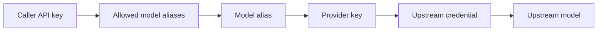

Review the resources created in the [Quickstart](../quickstart) and verify how
the proxy enforces them. The request path connects the caller key, model alias,
provider key, propagation state, and authorization checks behind the first
successful request.

:::note Standalone Only
The standalone `admin/v1` API listens on `127.0.0.1:3001`. A
[Cloud managed data plane](aisix-cloud-managed-dp.md) only exposes proxy APIs
locally and does **not** bind the standalone admin listener. In managed
deployments, create provider keys, models, and caller API keys through the
AISIX Cloud control plane.
:::

## How Resources Connect

A request moves through the caller key, model alias, and provider key before
AISIX sends it to the upstream model:



`ProviderKey` stores the upstream credential and provider connection details.

`Model` exposes the model alias callers send to AISIX. In the quickstart,
callers send `gpt-4o-prod`, while AISIX forwards the upstream model name
`gpt-4o-mini`.

`ApiKey` authenticates caller traffic. The gateway stores `key_hash`, the
SHA-256 hash of the plaintext caller key, and uses `allowed_models` to decide
which model aliases the caller can use.

## Prerequisites

Complete the [Quickstart](../quickstart) first, or start from a gateway that
already has a provider key, a direct model alias, and a caller API key.

Use these quickstart values:

```shell
export AISIX_ADMIN_KEY="admin-local-only-change-me"
export CALLER_KEY="sk-demo-caller"
export MODEL_ALIAS="gpt-4o-prod"
```

If you completed the quickstart, keep the captured `PROVIDER_KEY_ID`,
`MODEL_ID`, and `APIKEY_ID` variables in the same shell. The cleanup commands
below use them.

## Verify the Request Path

Start with the admin resources, then confirm that the proxy has loaded the
model alias and can serve a request with the caller key.

### Inspect the Resources

List the provider keys, models, and caller API keys that the admin API stores:

```shell
curl -sS http://127.0.0.1:3001/admin/v1/provider_keys \
  -H "Authorization: Bearer ${AISIX_ADMIN_KEY}"
```

```shell
curl -sS http://127.0.0.1:3001/admin/v1/models \
  -H "Authorization: Bearer ${AISIX_ADMIN_KEY}"
```

```shell
curl -sS http://127.0.0.1:3001/admin/v1/apikeys \
  -H "Authorization: Bearer ${AISIX_ADMIN_KEY}"
```

The provider-key response includes `secret` in plaintext. Treat provider-key
command output as sensitive, including output from later
`GET /admin/v1/provider_keys/:id` calls.

Check that the resources line up with the request path. The provider key should
have `display_name: "openai-upstream"` and the OpenAI adapter settings. The
model should have `display_name: "gpt-4o-prod"` and reference the provider key
with `provider_key_id`. The API key should include
`allowed_models: ["gpt-4o-prod"]`.

If one of those links is missing, fix the admin resource before debugging the
proxy API.

### Verify Propagation to the Proxy

Admin writes do not become visible to the proxy instantly. AISIX applies
dynamic resources asynchronously, so propagation is usually fast but not
instantaneous.

Poll the proxy until the model alias is visible to the caller key:

```shell
MODEL_VISIBLE=false
for i in $(seq 1 20); do
  MODELS_RESPONSE=$(curl -sS http://127.0.0.1:3000/v1/models \
    -H "Authorization: Bearer ${CALLER_KEY}")

  if echo "${MODELS_RESPONSE}" \
    | jq -e --arg model "${MODEL_ALIAS}" \
      '.data[]? | select(.id == $model)' >/dev/null; then
    MODEL_VISIBLE=true
    echo "model alias is visible"
    break
  fi
  sleep 0.5
done

if [ "${MODEL_VISIBLE}" != "true" ]; then
  echo "model alias is not visible yet; check the admin resources and proxy logs" >&2
fi
```

Then inspect the visible models:

```shell
curl -sS http://127.0.0.1:3000/v1/models \
  -H "Authorization: Bearer ${CALLER_KEY}"
```

A successful response uses this format:

```json
{
  "object": "list",
  "data": [
    {
      "id": "gpt-4o-prod",
      "object": "model",
      "created": 1715000000,
      "owned_by": "openai"
    }
  ]
}
```

`created` is a gateway-side Unix timestamp, so the exact value differs between
runs.

### Verify the Proxy Request

If the final quickstart request already succeeded, you can skip to
[Verify auth and allowlist enforcement](#verify-auth-and-allowlist-enforcement).
Otherwise, send one normal request with the caller key and the allowed model
alias:

```shell
curl -sS -X POST http://127.0.0.1:3000/v1/chat/completions \
  -H "Authorization: Bearer ${CALLER_KEY}" \
  -H "Content-Type: application/json" \
  -d '{
    "model": "gpt-4o-prod",
    "messages": [
      {"role": "user", "content": "Say hello from AISIX."}
    ]
  }'
```

With a valid upstream provider key, the response follows the OpenAI
chat-completions format.

The application never sends the upstream provider key. The caller sends only
the gateway-issued caller key. AISIX resolves the model alias and uses the
provider key on the upstream side.

## Verify Auth and Allowlist Enforcement

Two negative-path checks confirm that the proxy is enforcing the admin
resources, not only forwarding traffic.

### Missing Bearer Returns `401`

Send the same request without `Authorization`:

```shell
curl -sS -o /dev/null -w "%{http_code}\n" -X POST http://127.0.0.1:3000/v1/chat/completions \
  -H "Content-Type: application/json" \
  -d '{"model":"gpt-4o-prod","messages":[{"role":"user","content":"hi"}]}'
```

Expected status: `401`.

The proxy response body uses the OpenAI-compatible error envelope:

```json
{
  "error": {
    "message": "missing or malformed Authorization header",
    "type": "invalid_api_key"
  }
}
```

### Unauthorized Model Is Rejected

Ask for a model alias the caller key cannot use:

```shell
curl -sS -X POST http://127.0.0.1:3000/v1/chat/completions \
  -H "Authorization: Bearer ${CALLER_KEY}" \
  -H "Content-Type: application/json" \
  -d '{"model":"some-model-not-in-allowed-models","messages":[{"role":"user","content":"hi"}]}'
```

Expected result:

| Status | Meaning |
| --- | --- |
| `403` with `"type": "permission_denied"` | The alias exists but is not listed in `allowed_models`. |
| `404` with `"type": "model_not_found"` | The alias does not exist in the loaded proxy configuration. |

These checks exercise the same authentication and authorization path that gates
production traffic.

## Troubleshoot the Resource Chain

Use the first failing status code to locate the failing part of the chain:

| Status and type | Likely cause |
| --- | --- |
| `401 invalid_api_key` | The caller key is missing, malformed, or unknown to the loaded proxy configuration. |
| `403 permission_denied` | The key exists, but the resolved model alias is not in `allowed_models`. |
| `404 model_not_found` | The model alias does not resolve in the loaded proxy configuration. |
| `503 provider_unavailable` | No provider adapter is available for the resolved provider, or every routing candidate is unavailable. |

Admin API errors use a different envelope:

```json
{
  "error_msg": "..."
}
```

See [Headers and error codes](../reference/headers-and-error-codes.md) for
proxy and admin error handling.

## Clean Up When Done

:::warning Cleanup Timing
The SDK quickstarts reuse the local gateway, caller key, and model alias from
this walkthrough. Run the cleanup commands after any local SDK walkthroughs you
want to complete.
:::

Delete the quickstart resources in reverse dependency order:

```shell
curl -sS -X DELETE http://127.0.0.1:3001/admin/v1/apikeys/${APIKEY_ID} \
  -H "Authorization: Bearer ${AISIX_ADMIN_KEY}"
```

```shell
curl -sS -X DELETE http://127.0.0.1:3001/admin/v1/models/${MODEL_ID} \
  -H "Authorization: Bearer ${AISIX_ADMIN_KEY}"
```

```shell
curl -sS -X DELETE http://127.0.0.1:3001/admin/v1/provider_keys/${PROVIDER_KEY_ID} \
  -H "Authorization: Bearer ${AISIX_ADMIN_KEY}"
```

Then remove the local gateway stack:

```shell
docker compose down -v
```

## Related Reading

Read [Core concepts](../overview/core-concepts.md) for the resource model, or
continue with the [OpenAI SDK Quickstart](openai-sdk.md) or
[Anthropic SDK Quickstart](anthropic-sdk.md) to call the gateway from
application code. For resource details, see
[Models](../configuration/models.md) and [API keys](../configuration/api-keys.md).
