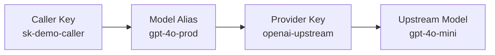

Run AISIX AI Gateway locally, configure the minimum resources required for
traffic, and send one request through the OpenAI-compatible proxy API.

## Request Path



The diagram shows the minimum request path: the caller key authenticates the
client, the model alias selects the model, and the provider key supplies the
upstream credential. In this quickstart, callers send `gpt-4o-prod` to AISIX,
while AISIX sends `gpt-4o-mini` to OpenAI. The caller never sends the upstream
provider key.

## Prerequisites

Before you start, install Docker with Docker Compose, `curl`, and `jq`. You
also need an upstream provider API key. This quickstart uses OpenAI for the
final LLM request.

## Prepare the Environment

### Create a Working Directory

```shell
mkdir aisix-quickstart
cd aisix-quickstart
```

### Create a Local Config

Create `config.yaml` for the local gateway container:

```yaml title="config.yaml"
etcd:
  endpoints:
    - "http://etcd:2379"
  prefix: "/aisix"
  dial_timeout_ms: 5000
  request_timeout_ms: 5000

proxy:
  addr: "0.0.0.0:3000"
  request_body_limit_bytes: 10485760

admin:
  addr: "0.0.0.0:3001"
  admin_keys:
    - "admin-local-only-change-me"

observability:
  service_name: "aisix"
  log_level: "info"
  access_log: true

cache:
  backend: "memory"
```

AISIX uses etcd as its configuration store in self-hosted mode. In this Compose
stack, the gateway reaches etcd through the service name `etcd`.

### Create the Compose Stack

Create `docker-compose.yml`:

```yaml title="docker-compose.yml"
services:
  etcd:
    image: quay.io/coreos/etcd:v3.5.18
    command:
      - /usr/local/bin/etcd
      - --advertise-client-urls=http://0.0.0.0:2379
      - --listen-client-urls=http://0.0.0.0:2379
    ports:
      - "2379:2379"

  aisix:
    image: ghcr.io/api7/ai-gateway:dev
    volumes:
      - ./config.yaml:/etc/aisix/config.yaml:ro
    ports:
      - "3000:3000"
      - "3001:3001"
    depends_on:
      - etcd
```

:::note
`ghcr.io/api7/ai-gateway:dev` tracks the `main` branch. For a reproducible
deployment, pin a released version tag once one is available.
:::

## Start and Verify the Gateway

### Start the Gateway

```shell
docker compose up -d
```

Verify that both containers are running:

```shell
docker compose ps
```

The gateway exposes the proxy listener on `http://127.0.0.1:3000` and the
admin listener on `http://127.0.0.1:3001`.

### Verify the Listeners

In a new terminal, verify that both listeners are healthy:

```shell
curl -sS http://127.0.0.1:3000/livez
```

```shell
curl -sS http://127.0.0.1:3001/livez
```

A healthy gateway returns:

```text
ok
```

The remaining steps configure a real provider-backed request path.

## Create the First Resources

### Export Local Variables

Export the values used by the remaining commands:

```shell
export AISIX_ADMIN_KEY="admin-local-only-change-me"
export OPENAI_API_KEY="YOUR_OPENAI_API_KEY"
export CALLER_KEY="sk-demo-caller"
```

Replace `YOUR_OPENAI_API_KEY` with a real upstream key. Without a valid
provider credential, the admin resources can still be created, but the final
proxy request will fail when AISIX calls the upstream provider.

The remaining steps create a **provider key** for the upstream credential, a
**model alias** that callers use on the proxy API, and a **caller API key** that
authenticates client traffic to AISIX.

### Create a Provider Key

```shell
PROVIDER_KEY_ID=$(curl -sS -X POST http://127.0.0.1:3001/admin/v1/provider_keys \
  -H "Authorization: Bearer ${AISIX_ADMIN_KEY}" \
  -H "Content-Type: application/json" \
  -d '{
    "display_name": "openai-upstream",
    "provider": "openai",
    "adapter": "openai",
    "secret": "'"${OPENAI_API_KEY}"'",
    "api_base": "https://api.openai.com/v1"
  }' | jq -r .id)
```

This creates the upstream credential AISIX uses when it forwards requests to
OpenAI and stores the returned resource ID in `PROVIDER_KEY_ID`.

:::warning Production Credentials
In standalone self-hosted mode, AISIX stores provider-key `secret` values as
plaintext under the configured etcd `prefix`. For production, protect etcd with
the same care as any secret store, including encryption at rest and restricted
access. In AISIX Cloud managed deployments, provider credentials are managed by
the control plane and projected to data planes.
:::

:::note Provider Base URL
This quickstart uses OpenAI, so `api_base` is `https://api.openai.com/v1`. Do
not reuse that value for every provider. Provider base URL requirements differ;
see [Provider Keys](../configuration/provider-keys.md#configure-the-base-url)
and
[Base URL Normalization](../configuration/provider-keys.md#base-url-normalization).
:::

### Create a Model Alias

In this resource, `display_name` is the model alias callers send to AISIX.
`model_name` is the upstream model ID that AISIX sends to the provider.

```shell
MODEL_ID=$(curl -sS -X POST http://127.0.0.1:3001/admin/v1/models \
  -H "Authorization: Bearer ${AISIX_ADMIN_KEY}" \
  -H "Content-Type: application/json" \
  -d '{
    "display_name": "gpt-4o-prod",
    "provider": "openai",
    "model_name": "gpt-4o-mini",
    "provider_key_id": "'"${PROVIDER_KEY_ID}"'"
  }' | jq -r .id)
```

Clients use `gpt-4o-prod` as the `model` value on the proxy API. The upstream
provider receives `gpt-4o-mini`.

### Create a Caller API Key

AISIX stores a hash of the caller key rather than the plaintext value. Hash the
caller key first:

```shell
if command -v sha256sum >/dev/null 2>&1; then
  CALLER_KEY_HASH=$(printf '%s' "${CALLER_KEY}" | sha256sum | cut -d' ' -f1)
else
  CALLER_KEY_HASH=$(printf '%s' "${CALLER_KEY}" | shasum -a 256 | awk '{print $1}')
fi
```

Then create the API key resource:

```shell
APIKEY_ID=$(curl -sS -X POST http://127.0.0.1:3001/admin/v1/apikeys \
  -H "Authorization: Bearer ${AISIX_ADMIN_KEY}" \
  -H "Content-Type: application/json" \
  -d '{
    "key_hash": "'"${CALLER_KEY_HASH}"'",
    "allowed_models": ["gpt-4o-prod"]
  }' | jq -r .id)
```

Verify that all three resource IDs were captured:

```shell
printf 'provider key: %s\nmodel: %s\napi key: %s\n' \
  "${PROVIDER_KEY_ID}" "${MODEL_ID}" "${APIKEY_ID}"
```

If any value is empty or `null`, check the previous command output for an
`error_msg` before continuing.

## Validate Traffic

### Verify Model Visibility

The admin API writes to etcd first. The proxy applies those changes
asynchronously.

Poll `/v1/models` until the model alias is visible to the caller key:

```shell
MODEL_VISIBLE=false
for i in $(seq 1 20); do
  if curl -sS http://127.0.0.1:3000/v1/models \
    -H "Authorization: Bearer ${CALLER_KEY}" \
    | jq -e '.data[]? | select(.id == "gpt-4o-prod")' >/dev/null; then
    MODEL_VISIBLE=true
    echo "model alias is visible"
    break
  fi
  sleep 0.5
done

if [ "${MODEL_VISIBLE}" != "true" ]; then
  echo "model alias is not visible yet; check the admin resources and proxy logs" >&2
fi
```

Optionally inspect the caller-visible model list:

```shell
curl -sS http://127.0.0.1:3000/v1/models \
  -H "Authorization: Bearer ${CALLER_KEY}"
```

The response should include `gpt-4o-prod`.

At this point, the gateway is running and the proxy can see the configured model
alias. `/v1/models` confirms caller authentication, model allowlisting, and
configuration propagation. The next request sends traffic through the provider
key to the upstream provider.

### Send a Proxy Request

```shell
curl -sS -X POST http://127.0.0.1:3000/v1/chat/completions \
  -H "Authorization: Bearer ${CALLER_KEY}" \
  -H "Content-Type: application/json" \
  -d '{
    "model": "gpt-4o-prod",
    "messages": [
      {"role": "user", "content": "Say hello from AISIX AI Gateway."}
    ]
  }'
```

With a valid upstream provider key, the response follows the OpenAI
chat-completions format and includes the model alias `gpt-4o-prod`.

The gateway authenticates to the upstream provider with the provider key you
created earlier, while the caller authenticates to AISIX with the caller API
key. This separation is one of the core operating patterns in AISIX AI Gateway.

You can reuse this local gateway, caller key, and model alias in the SDK
quickstarts.

## Related Reading

Continue with
[Understand Admin Resources](first-model-first-key-first-request.md) to inspect
the resource chain, propagation behavior, auth checks, and cleanup flow. To call
the same gateway from application code, run the
[OpenAI SDK Quickstart](openai-sdk.md) or
[Anthropic SDK Quickstart](anthropic-sdk.md).
