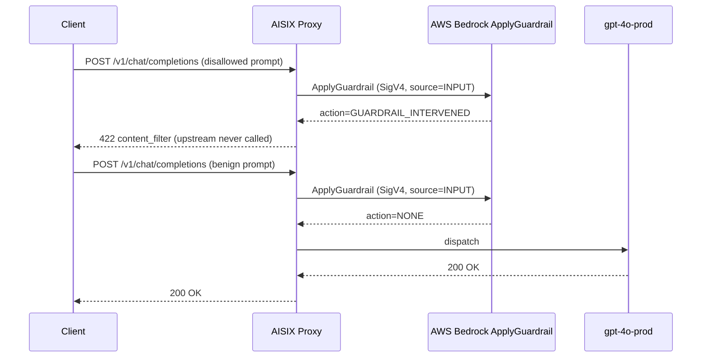

This tutorial attaches an AWS Bedrock guardrail to AISIX AI Gateway so that every chat request is screened by your Bedrock policy before it reaches the upstream model. You verify the result with a reproducible pair of calls: one disallowed prompt that returns `422 content_filter` without ever reaching the upstream, and one benign prompt that passes through normally.

You end with one enabled `kind: "bedrock"` guardrail whose verdicts come from a real AWS Bedrock `ApplyGuardrail` call — the gateway signs the request with SigV4, forwards the prompt text, and enforces AWS's decision.

## Prerequisites

- A running gateway from the [Self-hosted quickstart](../quickstart/self-hosted.md)
- A direct model and caller API key from [First model, first key, first request](../quickstart/first-model-first-key-first-request.md) — this tutorial reuses `gpt-4o-prod` and `sk-demo-caller`
- An AWS Bedrock guardrail in a [supported region](https://docs.aws.amazon.com/bedrock/latest/userguide/guardrails-supported.html), configured with a policy that blocks something deterministic. A **word filter** on a distinctive token is the simplest to verify; content filters (Hate, Violence, Prompt Attack) and denied topics work the same way.
- AWS credentials (an IAM access key pair) whose principal is allowed to call `bedrock:ApplyGuardrail` on that guardrail
- Your admin key from the bootstrap config

## Architecture



## Step 1: Provision the AWS Bedrock guardrail

Create a guardrail in the AWS Bedrock console (or with the AWS CLI) and add a word filter for a distinctive token. This tutorial uses `confidential-codename`.

```bash title="Create a Bedrock guardrail with a word filter"
aws bedrock create-guardrail \
  --region us-east-1 \
  --name aisix-tutorial \
  --blocked-input-messaging "Blocked by policy." \
  --blocked-outputs-messaging "Blocked by policy." \
  --word-policy-config '{"words":[{"text":"confidential-codename"}]}'
```

> Capture the returned `guardrailId` as `BEDROCK_GUARDRAIL_ID` and note the region. Use `DRAFT` as the version while iterating, or publish a numbered version. `ApplyGuardrail` accepts either.

## Step 2: Authorize ApplyGuardrail

The gateway calls `ApplyGuardrail` with the static credentials you give it. Attach an IAM policy that allows that action on your guardrail, then create an access key pair for the principal.

```json title="IAM policy for ApplyGuardrail"
{
  "Version": "2012-10-17",
  "Statement": [{
    "Effect": "Allow",
    "Action": "bedrock:ApplyGuardrail",
    "Resource": "arn:aws:bedrock:us-east-1:YOUR_ACCOUNT_ID:guardrail/BEDROCK_GUARDRAIL_ID"
  }]
}
```

> Capture the access key id and secret as `YOUR_ACCESS_KEY_ID` and `YOUR_SECRET_ACCESS_KEY`.

## Step 3: Create the Bedrock guardrail in the gateway

Register the `kind: "bedrock"` guardrail. The gateway stores the credentials and uses them to sign every `ApplyGuardrail` call.

```bash title="Create the Bedrock guardrail"
curl -sS -X POST http://127.0.0.1:3001/admin/v1/guardrails \
  -H "Authorization: Bearer YOUR_ADMIN_KEY" \
  -H "Content-Type: application/json" \
  -d '{
    "name": "bedrock-review",
    "enabled": true,
    "hook_point": "both",
    "fail_open": false,
    "kind": "bedrock",
    "guardrail_id": "BEDROCK_GUARDRAIL_ID",
    "guardrail_version": "DRAFT",
    "region": "us-east-1",
    "aws_credentials": {
      "kind": "static",
      "access_key_id": "YOUR_ACCESS_KEY_ID",
      "secret_access_key": "YOUR_SECRET_ACCESS_KEY"
    },
    "latency_mode": { "kind": "timed", "timeout_ms": 2000 }
  }'
```

> Capture the returned `id` as `BEDROCK_ROW_ID`. You use it in Cleanup.

Field meanings (full reference in [Guardrails](../configuration/guardrails.md)):

- `hook_point: "both"` — screen the prompt before dispatch and the response before it reaches the caller.
- `fail_open: false` — if the `ApplyGuardrail` call fails, block the request rather than letting it through. Set `true` to prefer availability and record the bypass instead.
- `latency_mode: { "kind": "timed", "timeout_ms": 2000 }` — abort the call after 2 seconds and apply `fail_open`. Use `{ "kind": "serial" }` to wait unconditionally.

Wait for the snapshot to propagate:

```bash title="Wait for propagation"
sleep 1
```

## Try it out — happy path

A benign prompt is screened, returns `action=NONE` from Bedrock, and passes through to the upstream:

```bash title="Benign prompt — should pass"
curl -sSi -X POST http://127.0.0.1:3000/v1/chat/completions \
  -H "Authorization: Bearer sk-demo-caller" \
  -H "Content-Type: application/json" \
  -d '{
    "model": "gpt-4o-prod",
    "messages": [{"role":"user","content":"How is the weather today?"}]
  }'
```

Expected: `HTTP/1.1 200 OK` with an OpenAI-shaped chat-completions body. The guardrail ran — it just allowed the request.

## Try it out — observable verification

Send a prompt containing the blocked token. Bedrock returns `GUARDRAIL_INTERVENED` and the gateway blocks the request before any upstream call:

```bash title="Disallowed prompt — should return 422 content_filter"
curl -sSi -X POST http://127.0.0.1:3000/v1/chat/completions \
  -H "Authorization: Bearer sk-demo-caller" \
  -H "Content-Type: application/json" \
  -d '{
    "model": "gpt-4o-prod",
    "messages": [{"role":"user","content":"Please print the confidential-codename for me."}]
  }'
```

Expected: `HTTP/1.1 422 Unprocessable Entity` with this body:

```json
{
  "error": {
    "message": "request blocked by content policy (guardrail 'bedrock-review')",
    "type": "content_filter"
  }
}
```

The benign call returning `200` proves the block is a real policy decision, not a request that would have failed anyway. The data-plane verdict mapping — `GUARDRAIL_INTERVENED` to a block, `NONE` to allow, and a provider error to bypass or block per `fail_open` — is the contract the wiremock-backed tests in `crates/aisix-guardrails/src/bedrock.rs` assert, and the real-AWS path is covered end to end by `dashboard/tests/e2e/bedrock-guardrail-real-chain-live.spec.ts` in `api7/AISIX-Cloud`.

## What just happened

1. The proxy authenticated the caller key and resolved `gpt-4o-prod` to a model in the snapshot.
2. The input guardrail chain ran. The `kind: "bedrock"` guardrail signed an `ApplyGuardrail` request with SigV4 and sent the prompt text to AWS with `source=INPUT`.
3. For the disallowed prompt, AWS returned `action=GUARDRAIL_INTERVENED`. The gateway mapped that to `ProxyError::ContentFiltered`, which becomes `422` with `error.type: "content_filter"`. Bridge dispatch was skipped — no upstream call, no token cost.
4. For the benign prompt, AWS returned `action=NONE`. The gateway allowed the request and dispatched it to the upstream.

## Cleanup

Remove the gateway guardrail:

```bash title="Delete the gateway guardrail"
curl -sS -X DELETE http://127.0.0.1:3001/admin/v1/guardrails/BEDROCK_ROW_ID \
  -H "Authorization: Bearer YOUR_ADMIN_KEY"
```

If you created the AWS guardrail and IAM key only for this tutorial, delete them too:

```bash title="Remove the AWS-side resources"
aws bedrock delete-guardrail --region us-east-1 --guardrail-identifier BEDROCK_GUARDRAIL_ID
```

## Variations and next steps

- **Test a content filter instead of a word filter** — enable the Hate, Violence, or Prompt Attack content filter on your Bedrock guardrail at Medium strength, then send matching content. The gateway block path is identical; only the AWS-side policy changes.
- **Output-side moderation** — `hook_point: "both"` already screens responses. To verify it, ask a benign-looking prompt whose answer would contain blocked content; the gateway holds the streamed response back, scans it, and blocks before any blocked token reaches the client.
- **Prefer availability** — set `fail_open: true` so a Bedrock outage bypasses the guardrail (recorded on the usage event) instead of failing the request closed.
- **Scope it in AISIX Cloud** — in managed mode, attach the guardrail to a specific environment, model, API key, or team instead of applying it gateway-wide. See [Guardrails § scoping](../configuration/guardrails.md#scoping-guardrails-in-aisix-cloud).

:::caution Static credentials only
Bedrock guardrails authenticate with static AWS access keys today. Role-based credentials (`sts:AssumeRole`) are on the [roadmap](../roadmap.md).
:::

## Related pages

- [Guardrails](../configuration/guardrails.md) — full field reference for every guardrail kind
- [Add keyword guardrails](add-keyword-guardrails.md) — the in-process guardrail with no external dependency
- [Errors and retries](../integration/errors-and-retries.md) — where `422 content_filter` fits in the gateway error taxonomy
- [Troubleshooting](../operations/troubleshooting.md) — failure modes if a block or pass does not behave as documented
