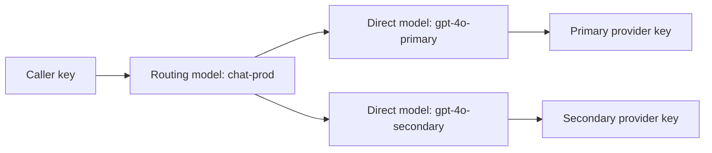

Create a virtual model that fails over from a primary model to a secondary
model. Applications call one model name while AISIX chooses the upstream model
for each request.

You create a routing model named `chat-prod`. The routing model points to two
direct models, and each direct model uses its own provider key. After the first
request succeeds, you point the primary upstream to an unreachable host to
verify failover.



## Prerequisites

Before you start, complete the [Quickstart](../quickstart), install
[`jq`](https://jqlang.github.io/jq/) to capture resource IDs, and prepare an
OpenAI API key for the secondary upstream.

You can use the same OpenAI API key for both upstreams. The failover check
points the primary provider key to an unreachable host so the request must move
to the secondary target.

## Set Variables

Export the values used in the commands:

```shell
export AISIX_ADMIN_KEY="admin-local-only-change-me"
export PRIMARY_OPENAI_API_KEY="YOUR_PRIMARY_PROVIDER_KEY"
export SECONDARY_OPENAI_API_KEY="YOUR_SECONDARY_PROVIDER_KEY"
export CALLER_KEY="sk-failover-demo"
```

If you use one OpenAI account for both upstreams, set
`PRIMARY_OPENAI_API_KEY` and `SECONDARY_OPENAI_API_KEY` to the same value.

Create the SHA-256 hash that AISIX stores for the caller key:

```shell
if command -v sha256sum >/dev/null 2>&1; then
  CALLER_KEY_HASH=$(printf '%s' "${CALLER_KEY}" | sha256sum | cut -d' ' -f1)
else
  CALLER_KEY_HASH=$(printf '%s' "${CALLER_KEY}" | shasum -a 256 | awk '{print $1}')
fi
```

## Configure the Virtual Model

To build `chat-prod`, create the provider keys, direct models, routing model,
and caller API key in order.

### Create Provider Keys

Create the primary provider key:

```shell
PRIMARY_PK_ID=$(curl -sS -X POST http://127.0.0.1:3001/admin/v1/provider_keys \
  -H "Authorization: Bearer ${AISIX_ADMIN_KEY}" \
  -H "Content-Type: application/json" \
  -d '{
    "display_name": "openai-primary",
    "provider": "openai",
    "adapter": "openai",
    "secret": "'"${PRIMARY_OPENAI_API_KEY}"'",
    "api_base": "https://api.openai.com/v1"
  }' | jq -r .id)
```

Create the secondary provider key:

```shell
SECONDARY_PK_ID=$(curl -sS -X POST http://127.0.0.1:3001/admin/v1/provider_keys \
  -H "Authorization: Bearer ${AISIX_ADMIN_KEY}" \
  -H "Content-Type: application/json" \
  -d '{
    "display_name": "openai-secondary",
    "provider": "openai",
    "adapter": "openai",
    "secret": "'"${SECONDARY_OPENAI_API_KEY}"'",
    "api_base": "https://api.openai.com/v1"
  }' | jq -r .id)
```

Verify that both IDs were captured:

```shell
printf 'primary provider key: %s\nsecondary provider key: %s\n' \
  "${PRIMARY_PK_ID}" "${SECONDARY_PK_ID}"
```

### Create Direct Models

Create the primary model:

```shell
PRIMARY_MODEL_ID=$(curl -sS -X POST http://127.0.0.1:3001/admin/v1/models \
  -H "Authorization: Bearer ${AISIX_ADMIN_KEY}" \
  -H "Content-Type: application/json" \
  -d '{
    "display_name": "gpt-4o-primary",
    "provider": "openai",
    "model_name": "gpt-4o-mini",
    "provider_key_id": "'"${PRIMARY_PK_ID}"'"
  }' | jq -r .id)
```

Create the secondary model:

```shell
SECONDARY_MODEL_ID=$(curl -sS -X POST http://127.0.0.1:3001/admin/v1/models \
  -H "Authorization: Bearer ${AISIX_ADMIN_KEY}" \
  -H "Content-Type: application/json" \
  -d '{
    "display_name": "gpt-4o-secondary",
    "provider": "openai",
    "model_name": "gpt-4o-mini",
    "provider_key_id": "'"${SECONDARY_PK_ID}"'"
  }' | jq -r .id)
```

### Create a Routing Model

Create a virtual model named `chat-prod`. The proxy starts with
`gpt-4o-primary`, retries it once, and then fails over to
`gpt-4o-secondary`.

```shell
CHAT_PROD_ID=$(curl -sS -X POST http://127.0.0.1:3001/admin/v1/models \
  -H "Authorization: Bearer ${AISIX_ADMIN_KEY}" \
  -H "Content-Type: application/json" \
  -d '{
    "display_name": "chat-prod",
    "routing": {
      "strategy": "failover",
      "targets": [
        {"model": "gpt-4o-primary"},
        {"model": "gpt-4o-secondary"}
      ],
      "retries": 1,
      "max_fallbacks": 1
    }
  }' | jq -r .id)
```

### Create an API Key

Create an API key that can call the virtual model:

```shell
APIKEY_ID=$(curl -sS -X POST http://127.0.0.1:3001/admin/v1/apikeys \
  -H "Authorization: Bearer ${AISIX_ADMIN_KEY}" \
  -H "Content-Type: application/json" \
  -d '{
    "key_hash": "'"${CALLER_KEY_HASH}"'",
    "allowed_models": ["chat-prod"]
  }' | jq -r .id)
```

Verify that the remaining IDs were captured:

```shell
printf 'primary model: %s\nsecondary model: %s\nrouting model: %s\napi key: %s\n' \
  "${PRIMARY_MODEL_ID}" "${SECONDARY_MODEL_ID}" "${CHAT_PROD_ID}" "${APIKEY_ID}"
```

If any value is empty or `null`, check the previous command output for an `error_msg` before continuing.

## Verify Failover Behavior

First confirm that the routing model can serve a normal request. Then break the
primary upstream and confirm that AISIX serves the request from the secondary
model.

### Verify the Routing Model

Send a request to `chat-prod`. Admin writes propagate asynchronously, so poll
until the proxy can serve the virtual model:

```shell
ROUTING_READY=false

for i in $(seq 1 20); do
  HTTP_CODE=$(curl -sS -o /tmp/aisix-failover-verify-body -w '%{http_code}' \
    -X POST http://127.0.0.1:3000/v1/chat/completions \
    -H "Authorization: Bearer ${CALLER_KEY}" \
    -H "Content-Type: application/json" \
    -d '{
      "model": "chat-prod",
      "messages": [
        {"role": "user", "content": "Say hello."}
      ]
    }')

  if [ "${HTTP_CODE}" = "200" ]; then
    cat /tmp/aisix-failover-verify-body
    ROUTING_READY=true
    break
  fi

  sleep 0.5
done

if [ "${ROUTING_READY}" != "true" ]; then
  cat /tmp/aisix-failover-verify-body
  echo "The routing model was not ready after 10 seconds." >&2
  exit 1
fi
```

A successful request returns an OpenAI-compatible chat-completions response.

### Trigger Failover

Update the primary provider key to point to an unreachable host:

```shell
curl -sS -X PUT "http://127.0.0.1:3001/admin/v1/provider_keys/${PRIMARY_PK_ID}" \
  -H "Authorization: Bearer ${AISIX_ADMIN_KEY}" \
  -H "Content-Type: application/json" \
  -d '{
    "display_name": "openai-primary",
    "provider": "openai",
    "adapter": "openai",
    "secret": "'"${PRIMARY_OPENAI_API_KEY}"'",
    "api_base": "https://api.openai.invalid/v1"
  }'
```

Send the request again and print response headers:

```shell
FAILOVER_READY=false

for i in $(seq 1 20); do
  HEADERS=$(curl -sS -o /tmp/aisix-failover-body -D - \
    -X POST http://127.0.0.1:3000/v1/chat/completions \
    -H "Authorization: Bearer ${CALLER_KEY}" \
    -H "Content-Type: application/json" \
    -d '{
      "model": "chat-prod",
      "messages": [
        {"role": "user", "content": "Say hello."}
      ]
    }')

  echo "${HEADERS}"

  if echo "${HEADERS}" | grep -qi '^x-aisix-served-by: gpt-4o-secondary'; then
    FAILOVER_READY=true
    break
  fi

  sleep 0.5
done

if [ "${FAILOVER_READY}" != "true" ]; then
  cat /tmp/aisix-failover-body
  echo "AISIX did not fail over to gpt-4o-secondary after 10 seconds." >&2
  exit 1
fi
```

A successful failover response includes `HTTP/1.1 200 OK` and this response
header:

```text
x-aisix-served-by: gpt-4o-secondary
```

The request still succeeds because AISIX retries the primary target and then
forwards the request to the secondary target.

### Verify Runtime Status

Check the runtime status of the direct models:

```shell
curl -sS http://127.0.0.1:3001/admin/v1/models/status \
  -H "Authorization: Bearer ${AISIX_ADMIN_KEY}"
```

A successful status response shows `gpt-4o-primary` in `cooldown` and
`gpt-4o-secondary` as
`healthy`. The routing model `chat-prod` reports `not_applicable` because
routing models do not send traffic directly to a provider.

## Clean Up

Restore the primary provider key before deleting resources:

```shell
curl -sS -X PUT "http://127.0.0.1:3001/admin/v1/provider_keys/${PRIMARY_PK_ID}" \
  -H "Authorization: Bearer ${AISIX_ADMIN_KEY}" \
  -H "Content-Type: application/json" \
  -d '{
    "display_name": "openai-primary",
    "provider": "openai",
    "adapter": "openai",
    "secret": "'"${PRIMARY_OPENAI_API_KEY}"'",
    "api_base": "https://api.openai.com/v1"
  }'
```

Delete the resources:

```shell
curl -sS -X DELETE "http://127.0.0.1:3001/admin/v1/models/${CHAT_PROD_ID}" \
  -H "Authorization: Bearer ${AISIX_ADMIN_KEY}"
curl -sS -X DELETE "http://127.0.0.1:3001/admin/v1/models/${PRIMARY_MODEL_ID}" \
  -H "Authorization: Bearer ${AISIX_ADMIN_KEY}"
curl -sS -X DELETE "http://127.0.0.1:3001/admin/v1/models/${SECONDARY_MODEL_ID}" \
  -H "Authorization: Bearer ${AISIX_ADMIN_KEY}"
curl -sS -X DELETE "http://127.0.0.1:3001/admin/v1/apikeys/${APIKEY_ID}" \
  -H "Authorization: Bearer ${AISIX_ADMIN_KEY}"
curl -sS -X DELETE "http://127.0.0.1:3001/admin/v1/provider_keys/${PRIMARY_PK_ID}" \
  -H "Authorization: Bearer ${AISIX_ADMIN_KEY}"
curl -sS -X DELETE "http://127.0.0.1:3001/admin/v1/provider_keys/${SECONDARY_PK_ID}" \
  -H "Authorization: Bearer ${AISIX_ADMIN_KEY}"
```

## Related Reading

For routing strategies, retries, and runtime filtering, see
[Routing and failover](../configuration/routing-and-failover.md).
