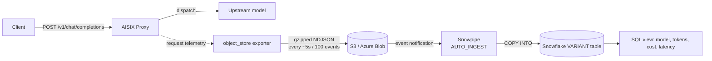

This tutorial lands the AISIX AI Gateway's per-request telemetry in Snowflake for FinOps, BI, and audit reporting. The gateway writes batched, gzipped NDJSON to a cloud bucket you own — Amazon S3 or Azure Blob — through an `object_store` observability exporter. Snowflake's [Snowpipe](https://docs.snowflake.com/en/user-guide/data-load-snowpipe-intro) auto-ingests each new file into a table as it arrives. No component pushes to Snowflake from the request hot path.

You end with an `object_store` exporter writing telemetry to your bucket, a Snowflake pipe auto-loading those files into a `VARIANT` landing table, and a SQL view that turns each request into queryable columns — model, token counts, cost, latency, cache outcome, and guardrail outcome.

:::note This is the object-storage staging path, not a first-party Snowflake sink
The `object_store` exporter is the available, shipping way to get gateway telemetry into Snowflake: the gateway writes files to a bucket you own, and you run Snowpipe — the same pattern Snowflake recommends for warehouse ingestion. A first-party Snowflake sink, where AISIX manages the pipe, schema, and exactly-once streaming for you, is on the [roadmap](../roadmap.md). This tutorial does not depend on it.

The `object_store` exporter ships **metadata only** — model, token counts, cost, latency, status, and cache/guardrail outcomes. It never writes the prompt or the response text to your bucket, so no end-user content reaches Snowflake on this path.
:::

## Architecture



## Prerequisites

- A running gateway from the [Self-hosted quickstart](../quickstart/self-hosted.md)
- A direct model and caller API key from [First model, first key, first request](../quickstart/first-model-first-key-first-request.md) — this tutorial reuses `gpt-4o-prod` and `sk-demo-caller`
- Your admin key from the bootstrap config
- **One** cloud bucket you own, in the same cloud you want to use:
  - an **Amazon S3** bucket, with permission to create an IAM role and an S3 event notification, or
  - an **Azure Blob** container, with permission to create a storage queue and an Event Grid subscription
- A **Snowflake** account and a role allowed to create integrations and pipes — `CREATE STORAGE INTEGRATION` and `CREATE NOTIFICATION INTEGRATION` require `ACCOUNTADMIN` or a role granted `CREATE INTEGRATION`. `SnowSQL` or a Snowflake worksheet to run the SQL

This tutorial uses the example bucket `acme-aisix-events` and prefix `ai-gateway` throughout. Substitute your own.

:::caution Keep one environment per bucket prefix for now
The exporter partitions objects by date and hour (`<prefix>/dt=…/hh=…/`) but does not yet add an org/environment segment to the key. If several environments export to the same `bucket` + `prefix`, their files intermix. Give each environment its own bucket or its own `prefix` so a Snowflake pipe loads exactly one environment's telemetry.
:::

## Step 1: Create the object_store exporter and confirm files land

Create the exporter, send a little traffic, and verify objects appear in your bucket **before** wiring Snowflake. This isolates the producing half: if files are in the bucket, the gateway side is done.

Follow the **Amazon S3** or **Azure Blob** subsection to match your bucket. The full field reference for every option — `cloud_identity` keyless auth, GCS, compression, S3-compatible endpoints — is in [Observability exporters](../configuration/observability-exporters.md).

### Amazon S3

Create an `object_store` exporter pointed at your S3 bucket. The data plane resolves `credential_ref` to AWS keys from its own environment — the secret never reaches the control plane.

```bash title="Create the S3 object_store exporter"
curl -sS -X POST http://127.0.0.1:3001/admin/v1/observability_exporters \
  -H "Authorization: Bearer YOUR_ADMIN_KEY" \
  -H "Content-Type: application/json" \
  -d '{
    "name": "snowflake-staging",
    "kind": "object_store",
    "provider": "s3",
    "bucket": "acme-aisix-events",
    "prefix": "ai-gateway",
    "region": "us-east-1",
    "credential_ref": "acme_s3_prod"
  }'
```

> Capture the returned `id` as `EXPORTER_ROW_ID`. You use it in Cleanup.

Set the matching keys on the **data plane** environment, then restart or wait for the snapshot to apply. The `<SLUG>` is `credential_ref` upper-cased (`acme_s3_prod` → `ACME_S3_PROD`):

```bash title="Set the data-plane credentials"
OBJSTORE_CRED_ACME_S3_PROD_AWS_ACCESS_KEY_ID=<your key id>
OBJSTORE_CRED_ACME_S3_PROD_AWS_SECRET_ACCESS_KEY=<your secret>
```

Send a couple of requests through the gateway so it produces telemetry, then wait for a flush (the shared delivery pipeline flushes every 5 seconds or 100 events):

```bash title="Generate gateway traffic"
for i in 1 2 3; do
  curl -sS -X POST http://127.0.0.1:3000/v1/chat/completions \
    -H "Authorization: Bearer sk-demo-caller" \
    -H "Content-Type: application/json" \
    -d '{"model":"gpt-4o-prod","messages":[{"role":"user","content":"ping"}]}' > /dev/null
done
sleep 8
```

Confirm objects landed under the partitioned prefix:

```bash title="List the staged objects"
aws s3 ls s3://acme-aisix-events/ai-gateway/ --recursive
```

Expected — one or more gzipped NDJSON objects under a `dt=…/hh=…` partition, each named by a SHA-256 content hash:

```text
2026-06-09 14:03:11        742 ai-gateway/dt=2026-06-09/hh=14/9f86d081884c7d659a2feaa0c55ad015.ndjson.gz
```

Download one and confirm each line is one metadata record with **no prompt or response text**:

```bash title="Inspect one object"
aws s3 cp s3://acme-aisix-events/ai-gateway/dt=2026-06-09/hh=14/<object>.ndjson.gz - | gunzip
```

Expected — one JSON object per line, carrying `schema_version` and the request metadata, and no `content` field:

```json
{"schema_version":"1.0","request_id":"3f1c…","occurred_at":"2026-06-09T14:03:10Z","model_id":"gpt-4o-prod","prompt_tokens":8,"completion_tokens":12,"latency_ms":612,"status_code":200,"cost_usd":0.00021,"cache_status":"miss","guardrail_blocked":false}
```

### Azure Blob

Create an `object_store` exporter pointed at your Azure Blob container (`bucket` is the container name for `azure_blob`):

```bash title="Create the Azure Blob object_store exporter"
curl -sS -X POST http://127.0.0.1:3001/admin/v1/observability_exporters \
  -H "Authorization: Bearer YOUR_ADMIN_KEY" \
  -H "Content-Type: application/json" \
  -d '{
    "name": "snowflake-staging",
    "kind": "object_store",
    "provider": "azure_blob",
    "bucket": "ai-gateway",
    "prefix": "ai-gateway",
    "credential_ref": "acme_az_prod"
  }'
```

> Capture the returned `id` as `EXPORTER_ROW_ID`. You use it in Cleanup.

Set the matching account and key on the **data plane** environment (`<SLUG>` is `ACME_AZ_PROD`):

```bash title="Set the data-plane credentials"
OBJSTORE_CRED_ACME_AZ_PROD_AZURE_ACCOUNT=<your storage account name>
OBJSTORE_CRED_ACME_AZ_PROD_AZURE_ACCESS_KEY=<your storage account key>
```

Generate traffic the same way, then confirm blobs landed:

```bash title="Generate traffic and list the staged blobs"
for i in 1 2 3; do
  curl -sS -X POST http://127.0.0.1:3000/v1/chat/completions \
    -H "Authorization: Bearer sk-demo-caller" \
    -H "Content-Type: application/json" \
    -d '{"model":"gpt-4o-prod","messages":[{"role":"user","content":"ping"}]}' > /dev/null
done
sleep 8

az storage blob list \
  --account-name <your storage account name> \
  --container-name ai-gateway \
  --prefix ai-gateway/ \
  --query "[].name" -o tsv
```

Expected — gzipped NDJSON blobs under the same `<prefix>/dt=…/hh=…/<hash>.ndjson.gz` layout as S3.

:::caution A missing credential fails delivery silently
The exporter config validates and shows as enabled even if its `OBJSTORE_CRED_<SLUG>_*` variables are unset — but every delivery then fails. If no objects appear, confirm the variables are set and non-empty on the data plane. See [Observability exporters § Troubleshooting](../configuration/observability-exporters.md#troubleshooting).
:::

## Step 2: Create the Snowflake landing table

In a Snowflake worksheet, create a database, schema, and a landing table with a single `VARIANT` column. Each NDJSON line becomes one row; the raw record stays in `record` and you extract typed columns with a view in Step 4.

```sql title="Snowflake: landing table"
CREATE DATABASE IF NOT EXISTS aisix;
CREATE SCHEMA   IF NOT EXISTS aisix.gateway;
USE SCHEMA aisix.gateway;

CREATE TABLE IF NOT EXISTS gateway_events (
  record       VARIANT,
  source_file  STRING,
  loaded_at    TIMESTAMP_LTZ DEFAULT CURRENT_TIMESTAMP()
);
```

The gateway writes gzipped NDJSON, so the pipe's file format is `TYPE = JSON` with `COMPRESSION = AUTO` (Snowflake detects gzip automatically, and the same format still loads uncompressed files if you set the exporter's `compression` to `none`).

## Step 3: Connect Snowflake to your bucket and create the auto-ingest pipe

Follow the subsection for your cloud. Both create a storage integration so Snowflake can read your bucket, an external stage over the gateway's prefix, and an `AUTO_INGEST` pipe that copies new files into `gateway_events`.

### Amazon S3

First, create the storage integration. Snowflake assumes the IAM role you name here to read the bucket ([S3 storage integration](https://docs.snowflake.com/en/user-guide/data-load-s3-config-storage-integration)):

```sql title="Snowflake: S3 storage integration"
CREATE STORAGE INTEGRATION aisix_s3_int
  TYPE = EXTERNAL_STAGE
  STORAGE_PROVIDER = 'S3'
  ENABLED = TRUE
  STORAGE_AWS_ROLE_ARN = 'arn:aws:iam::123456789012:role/aisix-snowflake-read'
  STORAGE_ALLOWED_LOCATIONS = ('s3://acme-aisix-events/ai-gateway/');

DESC INTEGRATION aisix_s3_int;
```

`DESC INTEGRATION` returns `STORAGE_AWS_IAM_USER_ARN` and `STORAGE_AWS_EXTERNAL_ID`. Edit the trust policy of the `aisix-snowflake-read` IAM role to allow that user ARN to assume it with that external ID, and grant the role `s3:GetObject` + `s3:GetObjectVersion` + `s3:ListBucket` on `acme-aisix-events/ai-gateway/*`. Then create the stage and the pipe:

```sql title="Snowflake: stage, pipe, and auto-ingest (S3)"
CREATE STAGE aisix_stage
  URL = 's3://acme-aisix-events/ai-gateway/'
  STORAGE_INTEGRATION = aisix_s3_int;

CREATE PIPE aisix_events_pipe
  AUTO_INGEST = TRUE
  AS
    COPY INTO gateway_events (record, source_file)
      FROM (SELECT $1, METADATA$FILENAME FROM @aisix_stage)
      FILE_FORMAT = (TYPE = JSON COMPRESSION = AUTO);

SHOW PIPES;
```

`SHOW PIPES` returns the SQS queue ARN in the **`notification_channel`** column. In the S3 console (or CLI), add a bucket **event notification** for **All object create events** that sends to that SQS queue ARN ([Snowpipe auto-ingest for S3](https://docs.snowflake.com/en/user-guide/data-load-snowpipe-auto-s3)):

```bash title="AWS: route new-object events to Snowpipe's SQS queue"
aws s3api put-bucket-notification-configuration \
  --bucket acme-aisix-events \
  --notification-configuration '{
    "QueueConfigurations": [{
      "QueueArn": "arn:aws:sqs:us-east-1:NNNN:sf-snowpipe-...",
      "Events": ["s3:ObjectCreated:*"],
      "Filter": {"Key": {"FilterRules": [{"Name": "prefix", "Value": "ai-gateway/"}]}}
    }]
  }'
```

### Azure Blob

First, route new-blob events to a storage queue with Event Grid ([Snowpipe auto-ingest for Azure](https://docs.snowflake.com/en/user-guide/data-load-snowpipe-auto-azure)):

```bash title="Azure: storage queue + Event Grid subscription"
az storage queue create --name aisix-snowpipe --account-name <storage_account>

az eventgrid event-subscription create \
  --source-resource-id "/subscriptions/<sub>/resourceGroups/<rg>/providers/Microsoft.Storage/storageAccounts/<storage_account>" \
  --name aisix-snowpipe-sub \
  --endpoint-type storagequeue \
  --endpoint "/subscriptions/<sub>/resourceGroups/<rg>/providers/Microsoft.Storage/storageAccounts/<storage_account>/queueServices/default/queues/aisix-snowpipe" \
  --advanced-filter data.api stringin CopyBlob PutBlob PutBlockList FlushWithClose
```

Create the notification integration so Snowflake reads that queue, then grant its service principal the **Storage Queue Data Contributor** role (find the principal with `DESC NOTIFICATION INTEGRATION`):

```sql title="Snowflake: notification integration (Azure)"
CREATE NOTIFICATION INTEGRATION aisix_az_notif
  ENABLED = TRUE
  TYPE = QUEUE
  NOTIFICATION_PROVIDER = AZURE_STORAGE_QUEUE
  AZURE_STORAGE_QUEUE_PRIMARY_URI = 'https://<storage_account>.queue.core.windows.net/aisix-snowpipe'
  AZURE_TENANT_ID = '<directory (tenant) id>';

DESC NOTIFICATION INTEGRATION aisix_az_notif;
```

Create the storage integration so Snowflake reads the container, then grant its service principal the **Storage Blob Data Reader** role (consent via the `AZURE_CONSENT_URL` from `DESC INTEGRATION`):

```sql title="Snowflake: storage integration, stage, and pipe (Azure)"
CREATE STORAGE INTEGRATION aisix_az_int
  TYPE = EXTERNAL_STAGE
  STORAGE_PROVIDER = 'AZURE'
  ENABLED = TRUE
  AZURE_TENANT_ID = '<directory (tenant) id>'
  STORAGE_ALLOWED_LOCATIONS = ('azure://<storage_account>.blob.core.windows.net/ai-gateway/ai-gateway/');

DESC INTEGRATION aisix_az_int;

CREATE STAGE aisix_stage
  URL = 'azure://<storage_account>.blob.core.windows.net/ai-gateway/ai-gateway/'
  STORAGE_INTEGRATION = aisix_az_int;

CREATE PIPE aisix_events_pipe
  AUTO_INGEST = TRUE
  INTEGRATION = 'AISIX_AZ_NOTIF'
  AS
    COPY INTO gateway_events (record, source_file)
      FROM (SELECT $1, METADATA$FILENAME FROM @aisix_stage)
      FILE_FORMAT = (TYPE = JSON COMPRESSION = AUTO);
```

The Azure container is `ai-gateway` and the exporter `prefix` is also `ai-gateway`, so the blob path is `ai-gateway/ai-gateway/dt=…/`; the stage URL points at that prefix.

## Step 4: Query the logs in Snowflake

Send a few more requests through the gateway (as in Step 1) and wait a minute or two for Snowpipe's micro-batch. Check the pipe is running and has no backlog:

```sql title="Snowflake: pipe status"
SELECT SYSTEM$PIPE_STATUS('aisix_events_pipe');
```

Expected — `executionState` is `RUNNING` and `pendingFileCount` drains to `0` as files load:

```json
{"executionState":"RUNNING","pendingFileCount":0,"lastReceivedMessageTimestamp":"2026-06-09T14:05:…","numOutstandingMessagesOnChannel":0}
```

Confirm rows arrived, then create a view that extracts typed columns from the `VARIANT` record. These field names are the gateway's request-event schema:

```sql title="Snowflake: count and project the telemetry"
SELECT COUNT(*) FROM gateway_events;

CREATE OR REPLACE VIEW gateway_requests AS
SELECT
  record:request_id::string             AS request_id,
  record:occurred_at::timestamp_tz      AS occurred_at,
  record:model_id::string               AS model_id,
  record:status_code::number            AS status_code,
  record:prompt_tokens::number          AS prompt_tokens,
  record:completion_tokens::number      AS completion_tokens,
  record:cost_usd::float                AS cost_usd,
  record:latency_ms::number             AS latency_ms,
  record:cache_status::string           AS cache_status,
  record:guardrail_blocked::boolean     AS guardrail_blocked,
  record:finish_reason::string          AS finish_reason,
  source_file
FROM gateway_events;

SELECT model_id, status_code, prompt_tokens, completion_tokens, cost_usd, cache_status
FROM gateway_requests
ORDER BY occurred_at DESC
LIMIT 10;
```

Expected — one row per gateway request, with token counts and cost, and no prompt or response columns anywhere in the schema:

```text
MODEL_ID     STATUS_CODE  PROMPT_TOKENS  COMPLETION_TOKENS  COST_USD   CACHE_STATUS
gpt-4o-prod  200          8              12                 0.00021    miss
gpt-4o-prod  200          8              14                 0.00023    miss
```

## Verify it works

The observable contract is that a request you send through the gateway becomes a structured, queryable Snowflake row — with the cost and token columns populated and the content columns absent.

A FinOps rollup over the view proves the data is usable, not just present:

```sql title="Snowflake: cost and tokens per model"
SELECT
  model_id,
  COUNT(*)                              AS requests,
  SUM(prompt_tokens + completion_tokens) AS total_tokens,
  ROUND(SUM(cost_usd), 5)               AS total_cost_usd
FROM gateway_requests
GROUP BY model_id
ORDER BY total_cost_usd DESC;
```

Expected — `requests` equals the number of calls you made, `total_tokens` is non-zero, and `total_cost_usd` is populated:

```text
MODEL_ID     REQUESTS  TOTAL_TOKENS  TOTAL_COST_USD
gpt-4o-prod  6         132           0.00132
```

The end-to-end path is real and tested: the `object_store` sink's NDJSON encoding, gzip, and content-addressed key layout are covered by the emulator smoke tests (MinIO, Azurite, and fake-gcs-server) in `crates/aisix-obs/src/sink/object_store.rs`, and the shared batch-and-flush delivery pipeline lives in `crates/aisix-obs/src/sink/pipeline.rs`.

## What just happened

1. The gateway recorded one `UsageEvent` of metadata per request and handed it to the `object_store` exporter's delivery pipeline — off the request hot path, so export never adds latency to a client call.
2. The pipeline batched events and flushed them (every 5 seconds or 100 events) as one gzipped NDJSON object, named by a SHA-256 prefix of its contents (a content address), under `<prefix>/dt=YYYY-MM-DD/hh=HH/`.
3. The bucket emitted a create-object event (to SQS for S3, to a storage queue via Event Grid for Azure), which Snowpipe consumed and used to `COPY` the new file into the `VARIANT` landing table.
4. The view projected the raw records into typed columns you can aggregate for cost, usage, and audit reporting.

Because each object is named by its content hash, a transient upload retry of an identical batch reuses the exact same object key, and Snowpipe's per-pipe load history skips a file name it has already loaded — so retries do not double-load. Delivery is otherwise at-least-once, so make downstream transforms idempotent (for example, `MERGE` on `request_id`) if you build curated tables.

## Cleanup

Remove the Snowflake objects:

```sql title="Snowflake: tear down"
DROP PIPE IF EXISTS aisix_events_pipe;
DROP STAGE IF EXISTS aisix_stage;
DROP VIEW IF EXISTS gateway_requests;
DROP TABLE IF EXISTS gateway_events;
DROP STORAGE INTEGRATION IF EXISTS aisix_s3_int;      -- S3
DROP STORAGE INTEGRATION IF EXISTS aisix_az_int;      -- Azure
DROP NOTIFICATION INTEGRATION IF EXISTS aisix_az_notif; -- Azure
```

Remove the bucket notification you added (S3: delete the event notification on `acme-aisix-events`; Azure: `az eventgrid event-subscription delete --name aisix-snowpipe-sub …` and delete the `aisix-snowpipe` queue), and delete the IAM role / role assignment if you created it only for this tutorial.

Remove the gateway exporter and unset its credentials:

```bash title="Delete the exporter"
curl -sS -X DELETE http://127.0.0.1:3001/admin/v1/observability_exporters/EXPORTER_ROW_ID \
  -H "Authorization: Bearer YOUR_ADMIN_KEY"
```

## Variations and next steps

- **Keyless auth on S3 or GCS** — when the data plane runs in the same cloud as the bucket, set `auth_mode: "cloud_identity"` and provision no keys. See [Observability exporters § Authentication](../configuration/observability-exporters.md#authentication).
- **S3-compatible stores** — point `endpoint` at MinIO or Cloudflare R2 and keep `provider: "s3"`. Snowflake also stages from those via an S3-compatible external stage.
- **Configure it in AISIX Cloud** — instead of the self-hosted admin API, create the same `object_store` exporter from the dashboard under your environment's **Observability** section. Credentials stay on the data plane and are referenced, not stored, by the control plane; the Snowflake half of this tutorial is identical.
- **Curated tables** — schedule a task that `MERGE`s from `gateway_events` into a typed, deduplicated model and build cost/usage rollups on top.
- **Other warehouses and sinks** — the same `object_store` exporter feeds Databricks Auto Loader, and the gateway also ships `aliyun_sls` and `datadog` exporters for operational logging. See [Observability exporters](../configuration/observability-exporters.md).

## Related pages

- [Observability exporters](../configuration/observability-exporters.md) — full field reference for `object_store` and every other exporter kind
- [Metrics and logs](../operations/metrics-and-logs.md) — the data plane's own metrics and request logs
- [Resource schemas](../reference/resource-schemas.md) — the schema map for `ObservabilityExporter`
- [Roadmap](../roadmap.md) — including the planned first-party Snowflake sink
