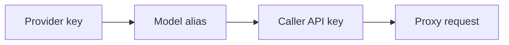

Tutorials show complete gateway scenarios from setup to verification. Start
after you finish the [Quickstart](../quickstart) and understand the basic
resource flow:

Each tutorial creates gateway resources, sends proxy traffic, verifies the
observable result, and includes cleanup steps.

## Before You Start

Start with a running standalone gateway from the [Quickstart](../quickstart),
an admin key for `Authorization: Bearer YOUR_ADMIN_KEY`, a caller key such as
`sk-demo-caller`, and at least one provider credential for live upstream
traffic.

Admin writes propagate asynchronously to the loaded proxy configuration. Where
propagation matters, the examples poll for the expected gateway behavior
instead of relying on a fixed delay.

## Choose a Tutorial

Start with [Use an OpenAI client with an Anthropic upstream](openai-client-to-anthropic-upstream.md)
to see protocol translation: the caller receives an OpenAI-compatible response
while the gateway calls Anthropic Messages upstream.

[Build a virtual model with failover](build-a-virtual-model-with-failover.md)
shows resilient routing with one stable model alias across primary and
secondary targets. [Add Keyword Guardrails](add-keyword-guardrails.md) shows
how to block forbidden prompt content at the gateway. [Enable Response
Caching](enable-response-caching.md) shows cache miss and hit behavior for
repeated chat-completion requests.

## Related Reading

For the resource model behind the tutorials, see
[Configuration overview](../configuration/overview.md). For production
deployment and runtime checks, see
[Operations](../operations/production-deployment.md). For API and schema
details, see [Proxy API reference](../reference/proxy-api-reference.md) and
[Resource schemas](../reference/resource-schemas.md).
